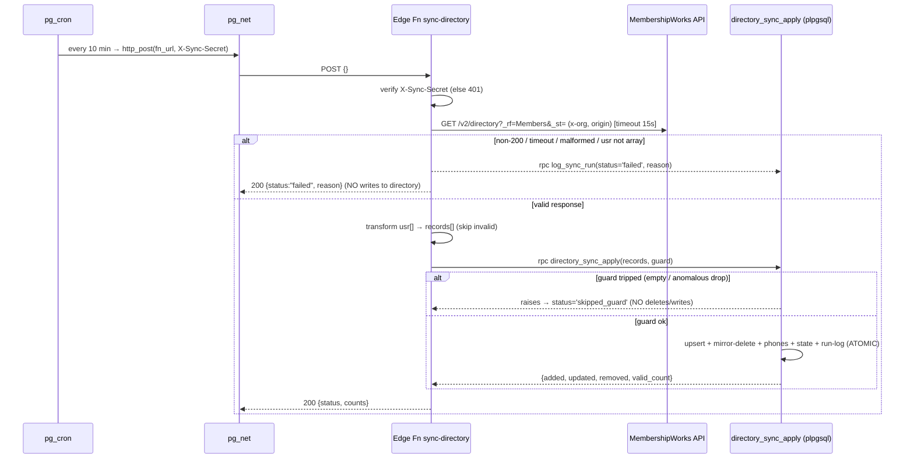

# Design: MembershipWorks → App Directory Auto-Sync

**Date:** 2026-06-27
**Type:** architecture + database + component
**Status:** Design specification only — no implementation (next: `/sc:implement`)
**Inputs:** `claudedocs/membershipworks-sync-requirements/README.md`, `claudedocs/research-membershipworks-sync/README.md`
**Locked decisions:** frequent poll (~10 min) · remove-on-disappear (mirror website) · Supabase-native (`pg_cron` + Edge Function)

---

## 1. Architecture overview

A Supabase-internal scheduler triggers a Deno Edge Function on a fixed interval. The function fetches the complete MembershipWorks (MW) directory in one unauthenticated GET, transforms it with the existing canonical transform logic, and hands the whole batch to **one** Postgres function that applies the change set **atomically** (upsert + mirror-delete + phone replace + state/log update) behind a destructive-write safety guard. The app reads `directory_businesses_app_view` exactly as today.

```
                        Supabase project (udbvtigwvhvxszimqlgj)
   ┌───────────────────────────────────────────────────────────────────────┐
   │                                                                         │
   │   pg_cron (*/10 * * * *)                                                 │
   │        │  select net.http_post(fn_url, headers{X-Sync-Secret}, '{}')    │
   │        ▼                                                                 │
   │   pg_net  ──────────────HTTP POST──────────────►  Edge Function         │
   │                                                   "sync-directory"      │
   │                                                        │                │
   │                                                        │ 1 GET (no auth)│
   │                                                        ▼                │
   │                                          api.membershipworks.com/v2/    │
   │                                          directory?_rf=Members&_st=     │
   │                                          (x-org:33993, shmoozeatl origin)│
   │                                                        │ {typ,usr[184]} │
   │                                                        ▼                │
   │                               transform (canonical, runtime-agnostic)   │
   │                                                        │ records[]      │
   │                                                        ▼                │
   │              rpc directory_sync_apply(p_records, p_guard)  ── ATOMIC ──┐ │
   │                 ├─ guard: abort if empty / anomalous drop              │ │
   │                 ├─ upsert directory_businesses (by source_uid)         │ │
   │                 ├─ delete rows whose source_uid ∉ feed (cascade phones)│ │
   │                 ├─ replace phones (reuse 0006 logic)                   │ │
   │                 ├─ update directory_sync_state (last_good_count, ts)   │ │
   │                 └─ insert directory_sync_runs (audit row)              │ │
   │                                                        │               │ │
   │                                                        ▼               │ │
   │   directory_businesses ──► directory_businesses_app_view ──► App reads ◄┘ │
   └───────────────────────────────────────────────────────────────────────┘
```

**Why this shape:**
- **Fetch+transform in the Edge Function** (not in Postgres): pulling external HTTP and parsing/decoding JSON is awkward and fragile via `pg_net` (async, fire-and-forget, no inline response processing). Deno does it cleanly.
- **Apply in ONE Postgres function** (not via multiple JS client calls): upsert + mirror-delete + phone replace + state update must be all-or-nothing. A single `plpgsql` function body is one transaction (same reasoning that produced migration `0006`). This also lets the destructive-write guard and the delete live in the same atomic unit — the guard can never be bypassed by a partial run.
- **`pg_cron` only triggers**; it carries no logic and no data.

---

## 2. Sequence (happy path + guarded-abort path)



---

## 3. Component design

### 3.1 Canonical transform (single source of truth)

**Problem:** the requirements demand one canonical transform to avoid drift, but the existing `scripts/directory-import/transform.ts` imports `he` (npm) and the Edge Function runs on Deno.

**Decision:** make the transform **runtime-agnostic** by removing the only non-portable dependency (`he`) in favor of a small inline HTML-entity decoder, then have **both** runtimes import the same file.

- New canonical location: `supabase/functions/_shared/directory-transform.ts` (plain TS, zero npm-only specifiers).
- The Bun importer (`scripts/directory-import/import.ts`) imports from this shared file instead of its local copy; the local `transform.ts` is deleted (or re-exports the shared file) to guarantee one implementation.
- **Inline decoder requirement:** the live data contains decimal numeric refs (e.g. `&#128170;` 💪), and named refs `&amp; &quot; &apos; &lt; &gt; &nbsp;`. The decoder must handle:
  - named: `& < > " ' ` (`&apos;`) and `&nbsp;`
  - decimal `&#NNN;` and hex `&#xHH;` (via `String.fromCodePoint`)
  - leave unknown entities untouched.
- All other transform functions (`transformRecord`, `splitLoc`, `extractPhones`, `toBooleanFlag`, `normalizePhone`, `stripSecrets`/`_mk` removal) port unchanged — they're already pure.

**Interface (unchanged contract):**
```ts
transformRecord(record: DirectoryRecord): BusinessRow | null   // null = skip (no uid / empty name)
extractPhones(phn: unknown): PhoneRow[]
decodeText(value: unknown): string | null                      // now inline decode, same signature
```

### 3.2 Edge Function `sync-directory`

**Location:** `supabase/functions/sync-directory/index.ts`
**Config:** `supabase/config.toml` → `[functions.sync-directory] verify_jwt = false` (auth handled by shared-secret header instead — see Security).

**Responsibilities (thin orchestrator):**
1. **Auth guard.** Require header `X-Sync-Secret == SYNC_TRIGGER_SECRET`; else `401`. (No public invocation.)
2. **Fetch.** `GET ${MW_DIRECTORY_URL}` with headers `{ accept: application/json, x-org: ${MW_ORG}, origin: https://www.shmoozeatl.com, referer: https://www.shmoozeatl.com/ }`, wrapped in `AbortController` timeout (`FETCH_TIMEOUT_MS`, default 15000).
3. **Validate envelope.** Require `res.ok`, JSON parse success, `Array.isArray(json.usr)`. Any failure → log a `failed` run, return `200 {status:"failed"}`, **touch nothing**.
4. **Transform.** Map `json.usr` → `records[]` of `{ business, phones }`, skipping invalid (mirrors `prepareRecords`). Track `valid_count`, `skipped`.
5. **Apply.** Call `rpc('directory_sync_apply', { p_records, p_max_drop_fraction, p_min_count_floor })`. The RPC returns `{ added, updated, removed, valid_count }` or raises a guard error.
6. **Respond.** Return `200` with a structured JSON result (`status`, counts, `duration_ms`). Never throw to the caller; failures are reported as data so `pg_cron`/`pg_net` see a clean response.

**Env vars (Function Secrets):**
| Var | Value / source | Notes |
|---|---|---|
| `MW_DIRECTORY_URL` | `https://api.membershipworks.com/v2/directory?_rf=Members&_st=` | constant; env-ized for testability |
| `MW_ORG` | `33993` | `x-org` header |
| `SUPABASE_URL` | auto-injected | for the service client |
| `SUPABASE_SERVICE_ROLE_KEY` | auto-injected | RPC is service-role only |
| `SYNC_TRIGGER_SECRET` | generated, stored in Vault + Function Secret | caller auth |
| `FETCH_TIMEOUT_MS` | `15000` | optional override |

**Pseudocode:**
```ts
serve(async (req) => {
  const startedAt = performance.now();
  if (req.headers.get("X-Sync-Secret") !== Deno.env.get("SYNC_TRIGGER_SECRET"))
    return json(401, { status: "unauthorized" });

  const supabase = serviceClient();
  let envelope;
  try {
    envelope = await fetchDirectory();          // GET + timeout + ok + JSON + usr[] checks
  } catch (e) {
    await supabase.rpc("directory_log_run", { p_status: "failed", p_reason: String(e) });
    return json(200, { status: "failed", reason: String(e) });   // NO directory writes
  }

  const { records, validCount, skipped } = transformAll(envelope.usr);

  const { data, error } = await supabase.rpc("directory_sync_apply", {
    p_records: records,                          // [{ business:{...}, phones:[...] }]
    p_max_drop_fraction: 0.40,
    p_min_count_floor: 50,
  });
  if (error) {                                   // includes guard raise
    return json(200, { status: classify(error), reason: error.message });
  }
  return json(200, { status: "ok", ...data, skipped, duration_ms: ms(startedAt) });
});
```

### 3.3 Database migration `0007_directory_sync.sql`

Adds state, audit, and the atomic apply function. **No change** to existing `directory_businesses` / phone tables (phone delete already cascades via FK `on delete cascade`).

**3.3.1 Sync state (singleton)** — holds the "last good" baseline for the guard.
```sql
create table if not exists public.directory_sync_state (
  id              boolean primary key default true check (id),   -- single-row guard
  last_good_count integer,
  last_success_at timestamptz,
  last_run_at     timestamptz
);
insert into public.directory_sync_state (id) values (true) on conflict do nothing;
```

**3.3.2 Sync run log (audit / observability — NFR5)**
```sql
create table if not exists public.directory_sync_runs (
  id            uuid primary key default gen_random_uuid(),
  ran_at        timestamptz not null default now(),
  status        text not null,            -- 'ok' | 'failed' | 'skipped_guard'
  http_status   integer,
  fetched_count integer,                  -- usr.length
  valid_count   integer,                  -- after transform/skip
  added         integer,
  updated       integer,
  removed       integer,
  reason        text,                     -- failure/guard detail
  duration_ms   integer
);
create index if not exists directory_sync_runs_ran_at_idx
  on public.directory_sync_runs (ran_at desc);
```

**3.3.3 Atomic apply function** — the heart of the design.
```sql
create or replace function public.directory_sync_apply(
  p_records           jsonb,          -- [{ business: {...BusinessRow}, phones: [...PhoneRow] }]
  p_max_drop_fraction numeric default 0.40,
  p_min_count_floor   integer default 50
) returns jsonb
language plpgsql
security definer
set search_path = public
as $$
declare
  v_valid      int := jsonb_array_length(coalesce(p_records, '[]'::jsonb));
  v_last_good  int;
  v_added int := 0; v_updated int := 0; v_removed int := 0;
begin
  select last_good_count into v_last_good from directory_sync_state where id;

  -- ── SAFETY GUARD (NFR2): never let a bad fetch wipe the directory ──
  if v_valid = 0 then
    raise exception 'directory_sync guard: zero valid records';
  end if;
  if v_last_good is not null
     and v_valid < v_last_good
     and (v_last_good - v_valid) > greatest(p_min_count_floor, ceil(v_last_good * p_max_drop_fraction))
  then
    raise exception 'directory_sync guard: anomalous drop % → %', v_last_good, v_valid;
  end if;

  -- 1) Stage incoming businesses into a temp set.
  create temp table _incoming on commit drop as
  select (r->'business'->>'source_uid') as source_uid,
         r->'business' as business,
         r->'phones'   as phones
  from jsonb_array_elements(p_records) r;

  -- 2) UPSERT businesses (track insert vs update via xmax trick).
  with up as (
    insert into directory_businesses
      (source_uid, name, description, logo_url, longitude, latitude,
       recommended_score, has_coupon, has_google_marker, raw_source_payload)
    select source_uid,
           business->>'name',
           business->>'description',
           business->>'logo_url',
           (business->>'longitude')::double precision,
           (business->>'latitude')::double precision,
           (business->>'recommended_score')::int,
           coalesce((business->>'has_coupon')::boolean, false),
           coalesce((business->>'has_google_marker')::boolean, false),
           business->'raw_source_payload'
    from _incoming
    on conflict (source_uid) do update set
      name = excluded.name, description = excluded.description, logo_url = excluded.logo_url,
      longitude = excluded.longitude, latitude = excluded.latitude,
      recommended_score = excluded.recommended_score, has_coupon = excluded.has_coupon,
      has_google_marker = excluded.has_google_marker, raw_source_payload = excluded.raw_source_payload
    returning (xmax = 0) as inserted
  )
  select count(*) filter (where inserted), count(*) filter (where not inserted)
    into v_added, v_updated from up;

  -- 3) MIRROR-DELETE: remove anything no longer in the feed (phones cascade).
  with del as (
    delete from directory_businesses b
    where not exists (select 1 from _incoming i where i.source_uid = b.source_uid)
    returning 1
  )
  select count(*) into v_removed from del;

  -- 4) REPLACE PHONES for the incoming set (delete+insert in this same txn).
  delete from directory_business_phone_numbers p
   using directory_businesses b
   where p.business_id = b.id
     and b.source_uid in (select source_uid from _incoming);

  insert into directory_business_phone_numbers
    (business_id, phone_number, normalized_phone_number, position)
  select b.id, ph->>'phone_number', ph->>'normalized_phone_number',
         coalesce((ph->>'position')::int, 0)
  from _incoming i
  join directory_businesses b on b.source_uid = i.source_uid
  cross join lateral jsonb_array_elements(coalesce(i.phones, '[]'::jsonb)) ph
  on conflict (business_id, phone_number) do nothing;

  -- 5) Update baseline + audit (same txn).
  update directory_sync_state
     set last_good_count = v_valid, last_success_at = now(), last_run_at = now()
   where id;

  insert into directory_sync_runs (status, valid_count, fetched_count, added, updated, removed)
  values ('ok', v_valid, v_valid, v_added, v_updated, v_removed);

  return jsonb_build_object('added', v_added, 'updated', v_updated,
                            'removed', v_removed, 'valid_count', v_valid);
end;
$$;

revoke all on function public.directory_sync_apply(jsonb, numeric, integer)
  from public, anon, authenticated;
grant execute on function public.directory_sync_apply(jsonb, numeric, integer) to service_role;
```
Plus a tiny `directory_log_run(p_status text, p_reason text)` helper for fetch-stage failures (logs a `failed`/`skipped_guard` row + bumps `last_run_at`), same grant pattern.

**RLS:** `directory_sync_state` and `directory_sync_runs` get RLS enabled with **no anon/auth policies** (service-role only), consistent with `directory_import_batches` in migration `0005`. The app never reads them.

### 3.4 Scheduler (`pg_cron` + `pg_net`)

Provisioned in a migration (so it's reproducible), reading the secret from **Supabase Vault** rather than inlining it.
```sql
-- extensions (Supabase: enable via dashboard or):
create extension if not exists pg_cron;
create extension if not exists pg_net;

-- store the trigger secret + function URL in Vault (one-time, not in VCS plaintext):
--   select vault.create_secret('<SYNC_TRIGGER_SECRET>', 'sync_trigger_secret');

select cron.schedule(
  'sync-directory',
  '*/10 * * * *',
  $$
  select net.http_post(
    url     := 'https://udbvtigwvhvxszimqlgj.supabase.co/functions/v1/sync-directory',
    headers := jsonb_build_object(
      'Content-Type', 'application/json',
      'X-Sync-Secret', (select decrypted_secret from vault.decrypted_secrets where name='sync_trigger_secret')
    ),
    body    := '{}'::jsonb
  );
  $$
);
```
`pg_net` is fire-and-forget (the function's own run-log is the source of truth for outcomes, not the cron job's return).

---

## 4. Data contracts

**MW record → BusinessRow** (already implemented in transform; unchanged):
| MW field | BusinessRow | Type | Notes |
|---|---|---|---|
| `uid` | `source_uid` | text (unique) | upsert key; record skipped if absent |
| `nam` | `name` | text | entity-decoded; skipped if empty |
| `cnm` | `description` | text? | entity-decoded |
| `lgo.s` | `logo_url` | text? | MW CDN URL |
| `loc[0]`,`loc[1]` | `longitude`,`latitude` | float? | ~43% null; validated range |
| `ir5` | `recommended_score` | int? | |
| `cpn` | `has_coupon` | bool | `1`→true |
| `xgm` | `has_google_marker` | bool | `1`→true |
| `phn[]` | child phone rows | text[] | `_mk` stripped from raw payload |

**RPC input** `p_records`: `[{ "business": BusinessRow, "phones": PhoneRow[] }]`.
**RPC output:** `{ added, updated, removed, valid_count }`.

---

## 5. Safety, idempotency, security

- **Destructive-write guard (NFR2):** delete only runs inside `directory_sync_apply`, which raises (→ full rollback, zero deletes) when `valid_count == 0` or the drop vs. `last_good_count` exceeds `max(floor 50, 40% of last good)`. Tunable via params. First-ever run has no baseline → guard only blocks the empty case (expected: 184 in, ~182 reconciled).
- **Idempotency / convergence (NFR4):** upsert-by-`source_uid` + full mirror-delete means an unchanged feed produces `added=0, updated=N, removed=0` and a DB identical to the feed every run. (Optional refinement: skip `updated` churn by diffing, but not required.)
- **Atomicity:** upsert + delete + phone replace + state + audit are one transaction; any error rolls back the entire apply (directory never left half-updated). Supersedes the need to call `directory_replace_phones` separately (its guarantee is folded in).
- **Security:**
  - Service-role key stays server-side (Edge Function env only); never in the app bundle — same boundary as `scripts/`.
  - `verify_jwt=false` + `X-Sync-Secret` shared secret prevents public invocation; secret stored in Vault + Function Secrets, never committed.
  - `directory_sync_apply` / `directory_log_run` are `security definer`, `search_path=public`, granted to `service_role` only.
  - MW endpoint needs no secret; we send the same public headers the website sends. No new external attack surface.
  - `_mk` (MW's Google Maps key) continues to be stripped before persistence.

---

## 6. Testing strategy (for `/sc:implement` + TDD)

- **Unit (transform, runtime-agnostic):** keep/extend existing `scripts/directory-import/__tests__`; add cases for the inline entity decoder (decimal emoji `&#128170;`, hex, named, unknown passthrough) to prove parity with the old `he` behavior on the real corpus.
- **RPC (pgTAP or integration against a local Supabase):**
  - happy path: insert N, re-run unchanged → removed=0; add 1 → added=1; drop 1 from feed → removed=1 (+phones gone).
  - **guard:** empty `p_records` raises & deletes nothing; a 41% drop raises & deletes nothing; a 39% drop proceeds.
  - phone replace: dupes deduped; member losing all phones ends with zero (matches feed).
- **Edge Function:** mock MW responses for `200` valid, non-200, timeout, malformed, `usr` not array → assert no RPC call on bad envelopes and correct `status` in the response; assert `401` without the secret.
- **End-to-end (manual, staging):** point the function at the live MW endpoint once, confirm `directory_sync_runs` row + app view reflects 184.

---

## 7. Build order (hand-off to `/sc:implement`)

1. **Migration `0007`** — `directory_sync_state`, `directory_sync_runs`, `directory_sync_apply`, `directory_log_run`, RLS, grants. (TDD with pgTAP/local.)
2. **Shared transform** — move to `supabase/functions/_shared/directory-transform.ts`, replace `he` with inline decoder, repoint the Bun importer, add decoder tests.
3. **Edge Function `sync-directory`** — fetch/validate/transform/apply + secret auth; `config.toml` `verify_jwt=false`; function tests.
4. **Secrets** — generate `SYNC_TRIGGER_SECRET`; set Function Secret + Vault secret.
5. **Scheduler migration** — enable `pg_cron`/`pg_net`, `cron.schedule('*/10 * * * *', …)`.
6. **Verify** — deploy to staging, trigger once manually (`curl` the function with the secret), inspect `directory_sync_runs`, confirm app view.
7. **Decommission** note: the manual Chrome-console import path is retired; keep `import.ts` only as a backfill/dev tool (now importing the shared transform).

---

## 8. Open decisions (resolved here) & remaining knobs

**Resolved in this design:**
- Cadence: **`*/10 * * * *`** (10 min). Knob in the cron migration.
- Guard threshold: **abort delete if `valid==0`, or drop > `max(50, 40% of last_good)`**. Params on the RPC.
- Removal mechanics: **hard delete inside the atomic apply; phones cascade** (FK already `on delete cascade`).
- Transform port: **drop `he`, inline decoder, one shared file**.
- Run logging: **`directory_sync_runs` table** (not just function logs).
- Invocation/auth: **`pg_net` POST + `X-Sync-Secret` (Vault), `verify_jwt=false`**.

**Remaining (confirm at implement time, low-risk):**
- Exact `max_drop_fraction`/`min_count_floor` values once we see real week-to-week churn (start 0.40 / 50).
- Whether to suppress `updated` churn (diff before update) — cosmetic; defer.
- Retention/cleanup policy for `directory_sync_runs` (e.g. prune > 90 days) — optional later cron.
- Alerting on consecutive `failed`/`skipped_guard` runs (e.g. a follow-up that reuses the owner's Slack via a separate notifier) — out of scope now, enabled by the run-log.

---

## Next step
Run **`/sc:implement`** following the build order in §7 (start with migration `0007` under TDD).
