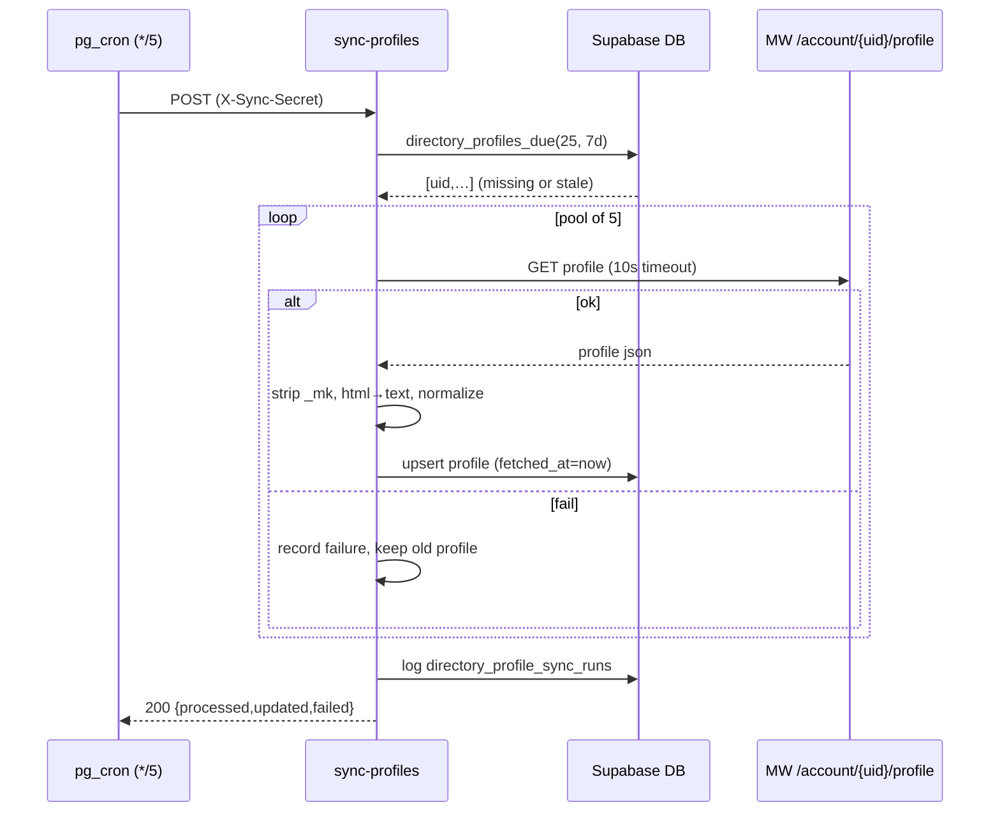

# Design: Business Profile Ingestion + Fuzzy Search (backend)

**Date:** 2026-06-27
**Type:** database + component + API
**Status:** Design only — no implementation (next: `/sc:implement`)
**Implements:** Epics **B** (profile ingestion) + **C** (fuzzy search) from `claudedocs/new-figma-round-requirements/README.md`
**Builds on:** the merged directory-sync pipeline (`claudedocs/membershipworks-sync-design/README.md`, `mem:membershipworks-sync`)

---

## 1. Overview

Two backend capabilities:

- **B — Profile ingestion:** pull each business's rich MW profile (`GET /v2/account/{uid}/profile`) into a new `directory_business_profiles` table. The profile's "About" HTML is the **search corpus** (it holds the bold keywords); the rest (address, website, socials, deal, photo gallery, contact) feeds the future business-detail screen (Epic E).
- **C — Fuzzy search:** a typo-tolerant, ranked `directory_search(q)` RPC over name + tagline + about-text, callable by the app.

Both extend — not replace — the existing directory sync. The directory feed stays the source for the provider list; profiles are a **separate, slower-cadence, incremental** enrichment so we never fetch 184 profiles in one shot.

```
                    Supabase project udbvtigwvhvxszimqlgj
  ┌──────────────────────────────────────────────────────────────────────────┐
  │  pg_cron sync-directory (*/10) ─▶ directory_businesses        (existing)   │
  │                                        │ source_uid (FK)                   │
  │  pg_cron sync-profiles (*/5)           ▼                                   │
  │     ─▶ Edge Fn "sync-profiles"   directory_business_profiles  (NEW, B)     │
  │          │ pick BATCH of stale/missing                                     │
  │          │ GET /v2/account/{uid}/profile  (pool of 5, ~80ms each)          │
  │          │ transform (strip _mk, html→text) ─▶ upsert by source_uid        │
  │          ▼                                                                 │
  │   directory_search(q) RPC  ◀── name(A)+tagline(B) tsv  +  about(C) tsv     │
  │     (FTS + pg_trgm, ranked)        + trigram typo tolerance                │
  │          ▲                                                                 │
  │   App: Directory search bar (debounced)   ·   detail screen reads profile  │
  └──────────────────────────────────────────────────────────────────────────┘
```

**Why incremental (not fold into sync-directory):** profiles change rarely; 184 fetches every 10 min is wasteful and risks the per-invocation budget. A bounded batch (e.g. 25/run) on a 5-min cron converges the full set in ~8 runs and then just refreshes stale rows + new businesses. Decouples profile freshness from directory freshness.

---

## 2. Data model

### 2.1 New table `directory_business_profiles` (1:1 with `directory_businesses`)
```sql
create table public.directory_business_profiles (
  source_uid    text primary key
                  references public.directory_businesses(source_uid) on delete cascade,
  about_text    text,                 -- About HTML stripped to plain text (SEARCH CORPUS)
  about_html    text,                 -- sanitized About HTML for the detail screen
  website       text,                 -- `web`
  contact_name  text,                 -- `ctc`
  address       jsonb,                -- `adr` (ad1, cit, sta, zip, cot, con) — `_mk`/loc not needed (in businesses)
  socials       jsonb,                -- `pfu` (bbb/fbk/igm/ylp/goo) + `pfk` labelled links, normalized
  deal          jsonb,                -- `cpn` (title cpt, text cpd, image cpa) or null
  gallery       jsonb,                -- `pfz` array of {s,l} image urls
  raw_profile   jsonb not null,       -- full response minus secrets (`_mk` stripped)
  fetched_at    timestamptz not null default now(),
  updated_at    timestamptz not null default now()
);
create trigger directory_business_profiles_set_updated_at
  before update on public.directory_business_profiles
  for each row execute function public.set_updated_at();   -- reuse fn from 0003
```
- FK `on delete cascade`: when a business drops from the directory, its profile goes too.
- `raw_profile` keeps every field queryable later (same philosophy as `raw_source_payload`).

### 2.2 Search columns (generated, always fresh)
```sql
-- on the EXISTING businesses table: name (weight A) + tagline (weight B)
alter table public.directory_businesses
  add column search_tsv tsvector generated always as (
    setweight(to_tsvector('english', coalesce(name, '')), 'A') ||
    setweight(to_tsvector('english', coalesce(description, '')), 'B')
  ) stored;

-- on profiles: about text (weight C)
alter table public.directory_business_profiles
  add column about_tsv tsvector generated always as (
    setweight(to_tsvector('english', coalesce(about_text, '')), 'C')
  ) stored;
```

### 2.3 Indexes (`pg_trgm` for typos; GIN for FTS)
```sql
create extension if not exists pg_trgm;
create index directory_businesses_search_tsv_idx on public.directory_businesses using gin (search_tsv);
create index directory_profiles_about_tsv_idx     on public.directory_business_profiles using gin (about_tsv);
create index directory_businesses_name_trgm_idx    on public.directory_businesses using gin (name gin_trgm_ops);
create index directory_profiles_about_trgm_idx     on public.directory_business_profiles using gin (about_text gin_trgm_ops);
```
*(At ~184 rows these are precautionary; they keep the design correct as the directory grows toward the full ~837.)*

### 2.4 RLS (mirror the directory: public read, service-role write)
```sql
alter table public.directory_business_profiles enable row level security;
create policy "Allow public read profiles" on public.directory_business_profiles
  for select to anon, authenticated using (true);
grant select on public.directory_business_profiles to anon, authenticated;
-- writes: service role only (bypasses RLS)
```

### 2.5 Detail-screen read path
```sql
create view public.directory_business_detail_view with (security_invoker = true) as
select b.source_uid, b.name, b.description, b.logo_url, b.longitude, b.latitude,
       b.recommended_score, b.has_coupon,
       p.about_text, p.about_html, p.website, p.contact_name,
       p.address, p.socials, p.deal, p.gallery,
       coalesce(jsonb_agg(jsonb_build_object('phone_number', ph.phone_number) order by ph.position)
                 filter (where ph.id is not null), '[]'::jsonb) as phone_numbers
from public.directory_businesses b
left join public.directory_business_profiles p on p.source_uid = b.source_uid
left join public.directory_business_phone_numbers ph on ph.business_id = b.id
group by b.id, p.source_uid;
```

---

## 3. Fuzzy search RPC (Epic C)

### 3.1 Contract
```
directory_search(q text, lim int default 30) -> setof rows
  shape = directory_businesses_app_view columns + `rank real`
  - returns [] when length(trim(q)) < 2
  - typo-tolerant, multi-word, ranked name(A) > tagline(B) > about(C)
  - STABLE, security invoker, granted to anon + authenticated (read-only over public data)
```

### 3.2 Ranking strategy (FTS + trigram, complementary)
- **Full-text** (`websearch_to_tsquery` over the weighted tsvectors) → semantic/multi-word/phrase matches, weighted A/B/C via `ts_rank_cd`. This is what makes `residential landscaping` hit Grantlanta's About text.
- **Trigram** (`word_similarity`) → typo/partial tolerance (`landscping`, prefixes), catching matches FTS misses.
- A row qualifies if **either** matches; final score blends both.

```sql
create or replace function public.directory_search(q text, lim integer default 30)
returns table (/* app_view columns */ ..., rank real)
language sql stable security invoker
set search_path = public
as $$
  with args as (
    select websearch_to_tsquery('english', q) as tsq,
           lower(btrim(q))                     as ql,
           length(btrim(q))                    as qlen
  )
  select v.*,
         (ts_rank_cd(b.search_tsv || coalesce(p.about_tsv, ''::tsvector), a.tsq) * 1.0
          + greatest(
              word_similarity(a.ql, b.name),
              word_similarity(a.ql, coalesce(b.description, '')),
              word_similarity(a.ql, coalesce(p.about_text, ''))
            ) * 0.4)::real as rank
  from args a
  join public.directory_businesses b on true
  left join public.directory_business_profiles p on p.source_uid = b.source_uid
  join public.directory_businesses_app_view v on v.source_uid = b.source_uid
  where a.qlen >= 2
    and (
      (b.search_tsv || coalesce(p.about_tsv, ''::tsvector)) @@ a.tsq
      or word_similarity(a.ql, b.name) > 0.3
      or word_similarity(a.ql, coalesce(b.description, '')) > 0.3
      or word_similarity(a.ql, coalesce(p.about_text, '')) > 0.3
    )
  order by rank desc, b.recommended_score desc nulls last, b.name
  limit greatest(1, least(lim, 50));
$$;

grant execute on function public.directory_search(text, integer) to anon, authenticated;
```
- Concatenating `search_tsv || about_tsv` preserves A/B/C weights so `ts_rank_cd` ranks name > tagline > about.
- `set_limit()` for the `%`-operator isn't needed since we call `word_similarity` directly with explicit thresholds (0.3 — tunable).
- The app calls this via `supabase.rpc('directory_search', { q, lim })`.

### 3.3 Example outcomes (acceptance)
| Query | Hits Grantlanta via | Why |
|---|---|---|
| `lawn` | name (A) | "Grantlanta **Lawn**" |
| `landscaping` | tagline (B) + about (C) | tagline "Atlanta Landscaping" |
| `residential landscaping` | about (C) | only in About text → needs Epic B data |
| `landscping` (typo) | trigram | `word_similarity` > 0.3 |
| `garden design` | about (C) | About prose |

---

## 4. Ingestion: `sync-profiles` Edge Function (Epic B)

### 4.1 Responsibilities
1. **Auth:** `X-Sync-Secret` header (reuse `SYNC_TRIGGER_SECRET`), `verify_jwt=false`.
2. **Select batch:** query businesses needing a refresh — `directory_businesses` LEFT JOIN profiles WHERE profile missing OR `fetched_at < now() - STALE_INTERVAL`, ordered `fetched_at nulls first`, `limit BATCH` (default 25). (Expose via a small `directory_profiles_due(p_limit, p_stale)` RPC or a plain select with the service key.)
3. **Fetch (bounded concurrency):** for each uid, `GET /v2/account/{uid}/profile` with the MW headers, pool size ~5, per-request 10s timeout.
4. **Transform:** parse → clean row; `about_html` (sanitized) + `about_text` (HTML→text via shared decoder); normalize `pfu`+`pfk`→socials, `cpn`→deal, `pfz`→gallery, `adr`→address; **strip `_mk`** from `raw_profile`.
5. **Upsert** by `source_uid` into `directory_business_profiles` (sets `fetched_at = now()`).
6. **Per-item isolation:** one failed fetch/parse is logged and skipped — it does NOT abort the batch and leaves the existing profile intact. No destructive deletes (FK cascade handles removals), so no count-guard needed.
7. **Log** a run row; return `{ processed, updated, failed, duration_ms }`.

### 4.2 Pseudocode
```ts
Deno.serve(async (req) => {
  if (req.headers.get("X-Sync-Secret") !== Deno.env.get("SYNC_TRIGGER_SECRET"))
    return json(401, { status: "unauthorized" });
  const supabase = serviceClient();
  const due = await supabase.rpc("directory_profiles_due", { p_limit: BATCH, p_stale_days: STALE_DAYS });
  const results = await pool(due.data, 5, async (uid) => {
    const profile = await fetchProfile(uid);            // GET /v2/account/{uid}/profile, 10s timeout
    const row = transformProfile(uid, profile);         // strip _mk, html→text, normalize
    await supabase.from("directory_business_profiles").upsert(row, { onConflict: "source_uid" });
  });                                                    // failures captured per-item, not thrown
  const r = tally(results);
  await supabase.rpc("directory_log_profile_run", { ...r, p_duration_ms: ms() });
  return json(200, { status: "ok", ...r });
});
```

### 4.3 Shared transform (one implementation, both runtimes)
- New `supabase/functions/_shared/profile-transform.ts` (pure TS, runtime-agnostic like `directory-transform.ts`).
- **Reuse** the inline entity decoder: export `htmlToText(html)` from `directory-transform.ts` (strip tags → decode entities → collapse whitespace) and call it for `about_text`. Keeps decode logic in ONE place.
- `about_html`: keep but **sanitize** (allowlist or strip script/style/on*-attrs) before storing, since the detail screen may render it.
- Unit-testable in jest via a shim (same pattern as the directory transform).

### 4.4 Scheduling
```sql
select cron.schedule('sync-profiles', '*/5 * * * *', $$
  select net.http_post(
    url     := 'https://udbvtigwvhvxszimqlgj.supabase.co/functions/v1/sync-profiles',
    headers := jsonb_build_object('Content-Type','application/json',
                 'X-Sync-Secret', (select decrypted_secret from vault.decrypted_secrets where name='sync_trigger_secret')),
    body    := '{}'::jsonb);
$$);
```
- BATCH=25, every 5 min → full 184 in ~40 min initially; steady state just refreshes stale (>7 days) + new businesses.

### 4.5 Run log
```sql
create table public.directory_profile_sync_runs (
  id uuid primary key default gen_random_uuid(),
  ran_at timestamptz not null default now(),
  status text not null, processed int, updated int, failed int,
  reason text, duration_ms int
);
```

---

## 5. Migrations
| Migration | Contents |
|---|---|
| `0010_directory_profiles.sql` | `directory_business_profiles` table + trigger; `search_tsv`/`about_tsv` generated cols; `pg_trgm` + indexes; RLS + grants; `directory_business_detail_view`; `directory_search` RPC; `directory_profiles_due` + `directory_log_profile_run` + `directory_profile_sync_runs` (service-role only) |
| `0011_sync_profiles_schedule.sql` | `cron.schedule('sync-profiles', '*/5 …')` (apply after the function is deployed; harmless 401s until then, same as 0008) |

New Edge Function dir: `supabase/functions/sync-profiles/` (+ `config.toml` entry `verify_jwt=false`).

---

## 6. Sequence — one profile-sync tick


---

## 7. Security & integrity
- `_mk` (MW Maps key) stripped before persisting `raw_profile` (reuse `stripSecrets`/`_mk` set from `directory-transform.ts`).
- Service-role-only writes; public read on profiles + detail view; `directory_search` is read-only over public data (safe for anon).
- `about_html` sanitized before storage (defense-in-depth for the detail screen render).
- No destructive operations in profile sync → no guard needed; per-item failures isolated; transient MW outage just delays a refresh.
- Reuses `SYNC_TRIGGER_SECRET` (note the carry-forward TODO to rotate it to a random value).

## 8. Testing
- **jest (transform):** `profile-transform` — About extraction (concatenate `_st.dir[lbl=About]` htm blocks), `htmlToText` (tags + entities incl. `&mdash;`/`&rsquo;`), `_mk` stripped, socials/deal/gallery normalization, graceful handling of missing About/deal/gallery.
- **pgTAP / local DB (search):** ranking order (name > tagline > about); `residential landscaping` → Grantlanta; typo `landscping` matches; `q` < 2 chars → empty; multi-word; limit cap.
- **Edge Function:** batch selection picks missing-first then stale; per-item failure doesn't abort; 401 without secret; `_mk` never persisted.
- Keep `tsc` + `jest` green.

## 9. Open items (confirm at implement time)
1. **Cadence/batch knobs:** `*/5`, BATCH 25, STALE 7d — confirm or tune. Initial full backfill could run a faster cron temporarily.
2. **`about_html` rendering:** will the detail screen render HTML (needs sanitize + an RN HTML renderer) or only show `about_text`? Affects whether we store/sanitize html.
3. **Search corpus extent:** include city/address tokens in the tsvector (so "Decatur" matches)? Currently name+tagline+about only.
4. **Trigram threshold** 0.3 and FTS/trgm blend weights (1.0 / 0.4) — tune against real queries.
5. **Detail-screen fields** depend on the (still-needed) Figma detail frame — may trim which profile fields we surface, but ingestion can store them all now.
6. **`directory_profiles_due` vs inline select** — minor; an RPC keeps the service-key query tidy and indexable.

---

## Next step
`/sc:implement` in order: **0010 migration** (table + search + indexes, TDD the RPC) → **shared `profile-transform` + `htmlToText`** (jest) → **`sync-profiles` Edge Function** + `config.toml` → **0011 schedule** → deploy + backfill + verify (`directory_search('residential landscaping')` returns Grantlanta).
