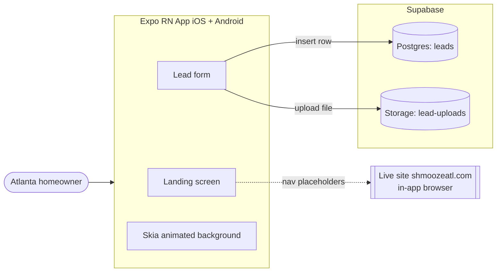
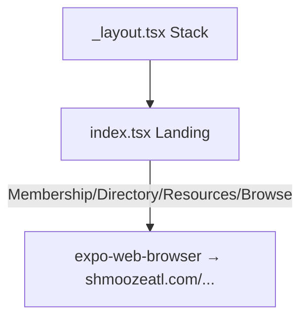
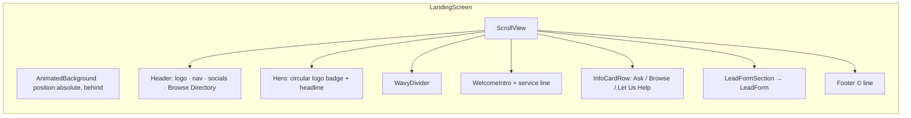
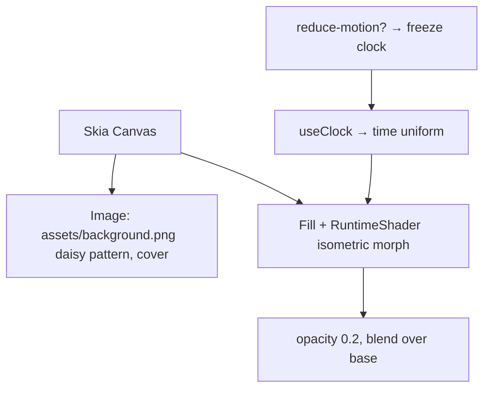
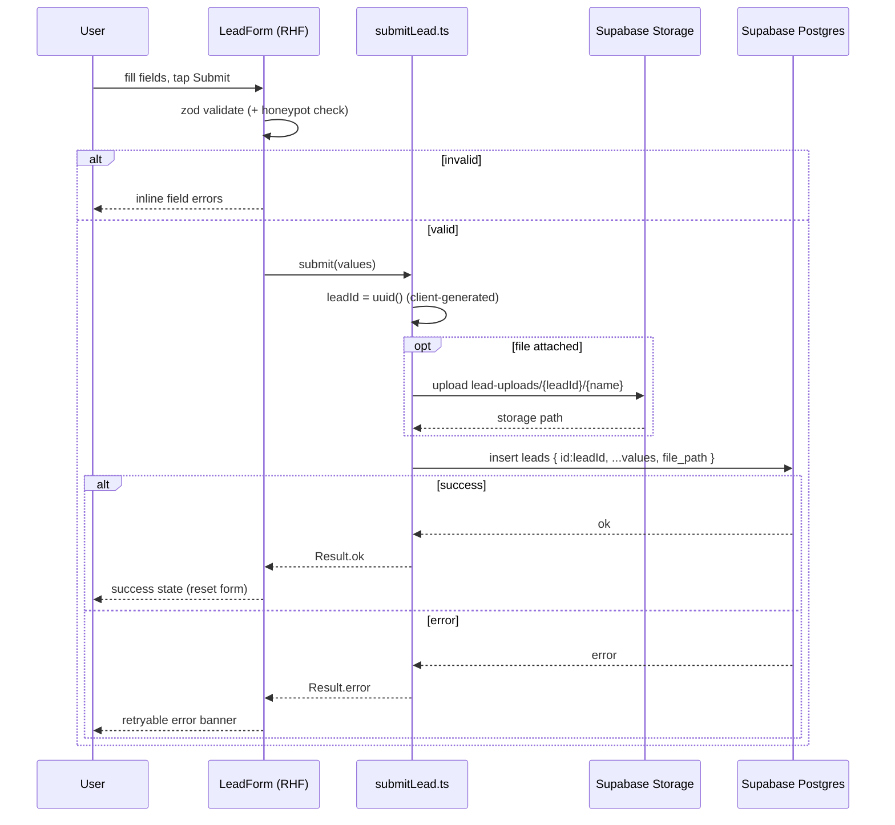

# The Southern Shmooze — Mobile App Architecture & Design

> System/architecture design produced via `/sc:design`. Implements the requirements in
> [`../mvp-requirements/README.md`](../mvp-requirements/README.md). **Design only** — build
> with `/sc:implement`.

**Stack:** Expo (React Native, native) · Bun · TypeScript · Expo Router · React Native Skia · React Hook Form + Zod · Supabase
**Generated:** 2026-06-24

---

## 1. System Context



The app is a **client-only** front end talking directly to Supabase via the JS SDK with
the **anon** key (insert-only RLS). No custom backend server in the MVP.

---

## 2. Technology Stack & Dependencies

| Concern | Choice | Notes |
|---|---|---|
| Runtime / tooling | **Bun** | `bun install`, `bunx expo` |
| Framework | **Expo SDK (managed)** + **Expo Router** | file-based routing; `app/` dir |
| Language | **TypeScript** (strict) | |
| Animated background | **@shopify/react-native-skia** | runtime SkSL shader for the morphing overlay |
| Form state | **react-hook-form** | performant, uncontrolled inputs |
| Validation | **zod** + `@hookform/resolvers` | schema at the boundary |
| Backend SDK | **@supabase/supabase-js** | + `react-native-url-polyfill` |
| File pickers | **expo-document-picker** (any file) + **expo-image-picker** (camera/photos) | "any type" → document-picker primary |
| Date field | **@react-native-community/datetimepicker** | native date UI |
| Fonts | **@expo-google-fonts/**{shrikhand,bitter,roboto} + **expo-font** | |
| Nav links | **expo-web-browser** | open live site for out-of-scope sections |
| Reduce motion | **AccessibilityInfo** (`isReduceMotionEnabled`) | auto-pause background |
| Env/secrets | **expo-constants** + `app.config.ts` `extra` | `SUPABASE_URL`, `SUPABASE_ANON_KEY` via env |
| Testing | **Jest + @testing-library/react-native**; **Maestro** (or Detox) for E2E | |

---

## 3. Project Structure

Many small, feature-organized files (per coding standards; <800 lines each).

```
app/                         # Expo Router routes
  _layout.tsx                # root stack, font + theme providers
  index.tsx                  # Landing screen (composition only)
src/
  theme/
    tokens.ts                # colors, spacing, radii, durations (from designlang)
    typography.ts            # font families + text styles
    ThemeProvider.tsx
  features/landing/
    LandingScreen.tsx
    components/
      Header.tsx
      Hero.tsx
      WelcomeIntro.tsx
      InfoCardRow.tsx
      InfoCard.tsx
      WavyDivider.tsx        # replicates the section "wavy" divider
      Footer.tsx
  features/background/
    AnimatedBackground.tsx   # Skia <Canvas>: daisy Image + shader overlay
    isometricShader.ts       # SkSL source + uniform mapping
    useBackgroundMotion.ts   # clock + reduce-motion gating
  features/lead-form/
    LeadForm.tsx             # RHF form composition
    fields/                  # TextField, PhoneField, BudgetCheckboxGroup, DateField, FileField, TextAreaField
    leadSchema.ts            # zod schema
    submitLead.ts            # orchestrates upload + insert
    useLeadForm.ts           # RHF setup + submit handler
    types.ts
  lib/
    supabase.ts              # configured client (singleton)
    result.ts                # Result<T> envelope helper
  components/ui/             # Button, Card primitives matching tokens
assets/                      # brand: background.png, logo, fonts (existing)
```

---

## 4. Navigation Design

Single primary route; nav items for out-of-scope sections open the live site in an
in-app browser (suggested default; see open items).



- `app/_layout.tsx`: loads fonts (gate render on `useFonts`), wraps `ThemeProvider`, hides native header (custom in-page header for 1:1).
- `app/index.tsx`: renders `LandingScreen`. Header is non-routing for MVP; taps invoke `WebBrowser.openBrowserAsync(url)`.

---

## 5. Landing Screen Composition



- `AnimatedBackground` is rendered once, absolutely positioned, behind a transparent
  `ScrollView`. It does **not** scroll with content as a parallax option later; for MVP it
  is a fixed morphing field (matches the site, where the generative layer is anchored to the hero section). Section bounds/scroll offset can drive optional parallax in a later pass.
- Visual tokens (colors, fonts, radii) come from `src/theme`.

---

## 6. Animated Background Design (the signature visual)

Two composited layers inside a single Skia `<Canvas>`:



**Mechanism reproduced** (from captured Squarespace `BackgroundIsometric` config):
isometric height-field of fractal noise, morphing over time, directionally lit, tinted
along a cream→orange gradient, composited at 0.2 opacity over the daisy base.

**SkSL runtime shader — uniform contract** (`isometricShader.ts`):

| Uniform | Source value | Meaning |
|---|---|---|
| `uTime` | `useClock()` × (speed/τ) | morph phase; `speed = 12` |
| `uResolution` | canvas size | aspect/scale |
| `uNoiseScale` | `77` → normalized | noise frequency |
| `uNoiseRange` | `69` → normalized | height amplitude |
| `uScale` | `vec3(76,39,95)` | isometric cell X/Y/Z |
| `uLight` | `vec3(-42,58,11)` norm | directional light |
| `uLightIntensity` | `84` → 0..1 | shading strength |
| `uColorA` | `#e1ded4` (lightAccent) | gradient start |
| `uColorB` | `#f1694f` (accent) | gradient end |

Shader outline: build isometric coordinates from fragment position and `uScale`;
sample fractal/simplex noise at `(p*uNoiseScale + uTime)`; derive a height field scaled by
`uNoiseRange`; compute a normal and Lambert term against `uLight`; `mix(uColorA,uColorB,
height)` modulated by light; output `rgb` with `a = 0.2`.

**Motion control** (`useBackgroundMotion.ts`): `useClock()` provides time; gate it on
`AccessibilityInfo.isReduceMotionEnabled()` and an `AppState` background check — when
reduce-motion is on or the app is backgrounded, hold the clock (the site's "pause"
behavior, minus the visible button). No pause UI is rendered.

**Risk / iteration note:** Squarespace's renderer is proprietary; exact 1:1 may take shader
iteration. At 0.2 opacity over a busy pattern the perceptual delta is small. If shader
matching runs long, the documented fallback is a captured seamless loop via `expo-av`
(not chosen, kept only as risk mitigation).

---

## 7. Lead Form Design

### 7.1 Field → control → schema → column map

| Field | Control component | Zod rule | DB column (`leads`) |
|---|---|---|---|
| First Name | `TextField` | `string().min(1)` | `first_name text` |
| Last Name | `TextField` | `string().min(1)` | `last_name text` |
| Email | `TextField` (email kbd) | `string().email()` | `email text` |
| Phone | `PhoneField` (tel kbd) | `string().min(7)` | `phone text` |
| Address | `TextField` | `string().min(1)` | `address text` |
| Budget | `BudgetCheckboxGroup` (**multi**) | `array(enum).default([])` | `budget text[]` |
| Project start date | `DateField` | `date().optional()` | `project_start_date date` |
| Project Details | `TextAreaField` | `string().min(1)` | `project_details text` |
| File Upload | `FileField` (any type) | `object({uri,name,mime,size}).optional()` | `file_path text` (Storage key) |
| _honeypot_ | hidden `TextField` | must be empty else reject | — (not stored) |

Budget enum: `'lt_1000' | '1000_5000' | 'gt_5000'` ↔ labels `< $1000` / `$1000 – $5000` / `> $5000`.

### 7.2 State & submission flow



- **Client-generated `leadId` (uuid)** lets us upload the file under a stable path first,
  then insert the row with `file_path` in one write (no update round-trip).
- All submission code returns a `Result<T>` envelope (`{ ok, data?, error? }`) — no thrown
  errors leak to the UI; messages are user-friendly, details logged.
- UI states: `idle → submitting → success | error`; Submit disabled while submitting.

### 7.3 Validation & a11y
- Inline errors per field, summary on submit; required fields marked.
- All inputs have accessible labels; date/file controls use native pickers.
- Honeypot field is visually hidden + `aria`-hidden; non-empty ⇒ silent reject.

---

## 8. Supabase Data Model

### 8.1 `leads` table

| Column | Type | Constraints |
|---|---|---|
| `id` | `uuid` | PK (client-supplied or `default gen_random_uuid()`) |
| `created_at` | `timestamptz` | `default now()` |
| `first_name` | `text` | `not null` |
| `last_name` | `text` | `not null` |
| `email` | `text` | `not null` |
| `phone` | `text` | `not null` |
| `address` | `text` | `not null` |
| `budget` | `text[]` | `default '{}'` (multi-select) |
| `project_start_date` | `date` | nullable |
| `project_details` | `text` | `not null` |
| `file_path` | `text` | nullable (Storage object key) |
| `status` | `text` | `default 'new'` |

Indexes: `created_at desc` (future admin), `status`.

### 8.2 Storage
- Bucket **`lead-uploads`**, **private**. Object key: `lead-uploads/{leadId}/{filename}`.
- Any MIME type; enforce a size cap client-side (suggest 25 MB) + bucket file-size limit.

### 8.3 Security (RLS) — public insert-only
- `leads`: enable RLS; policy `anon INSERT` allowed, **no SELECT/UPDATE/DELETE** for anon.
- Storage `lead-uploads`: policy allowing `anon INSERT` (upload) only; no public read.
- Anon key shipped in app is insert-scoped; no secret material beyond it. Owners read
  leads via Supabase dashboard/service role (out of scope here).
- Honeypot + (future) basic rate limiting mitigate spam.

---

## 9. Theming / Token Mapping

`src/theme/tokens.ts` (from designlang + live site):
```
colors: { bg:'#e1ded4', surface:'#ffffff', text:'#000000', muted:'#333333',
          secondary:'#0099dd', accent:'#f1694f', neutralLine:'#bbbbbb' }
radii:  { input: 2, card: 12, pill: 300 }
durations: { instant:75, xs:100, sm:170, md:300, lg:500, xl:1000 }
fonts:  { display:'Shrikhand', body:'Bitter', ui:'Roboto' }
```
Buttons: pill radius, black bg / white text (primary). Inputs: 1px border, ~2px radius,
white surface. Headline uses Shrikhand display scale.

---

## 10. Cross-Cutting Concerns
- **Error handling:** `Result<T>` envelope everywhere at the network boundary; user-facing
  copy + logged context; offline submit → clear retryable error, form state preserved.
- **Immutability:** RHF values + reducers updated via copies; no in-place mutation.
- **Performance:** Skia overlay targets 60fps; daisy `Image` downsampled to device width;
  fonts preloaded; form inputs uncontrolled.
- **Config:** `app.config.ts` reads `SUPABASE_URL`/`SUPABASE_ANON_KEY` from env into
  `extra`; `lib/supabase.ts` validates presence at startup.

---

## 11. Testing Strategy
- **Unit:** `leadSchema` (valid/invalid/honeypot), budget enum mapping, `Result` helper,
  shader uniform mapping.
- **Integration:** `submitLead` against a mocked Supabase client (upload+insert happy path,
  upload failure, insert failure).
- **Component:** `LeadForm` renders all 11 fields, blocks submit on invalid, shows success.
- **E2E (Maestro/Detox):** fill form → submit → success; reduce-motion freezes background.
- Target 80%+ coverage.

---

## 12. Open Items (carried from requirements)
- App identity (name/icon/splash) — default reuse site branding.
- Upload size cap (suggested 25 MB).
- Nav placeholder behavior — in-app browser (assumed) vs. "coming soon" screens.
- Optional scroll-parallax of the background in a later pass.

## 13. Next Step
`/sc:workflow` to generate the phased implementation plan, or `/sc:implement` to start
building (suggested order: scaffold + theme → Supabase schema/RLS → lead form + submit →
landing layout → Skia background → tests).
