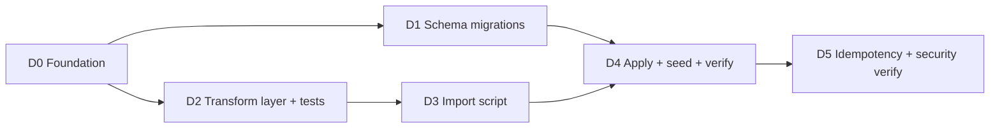

# Implementation Workflow — Directory Seed Spike

> Phased build plan (via `/sc:workflow`). **Plan only — no code executed.**
> Derives from [`../directory-seed-spike/README.md`](../directory-seed-spike/README.md) and the
> source design in `output/Design: Convert Directory JSON into Supabase Postgres Schem.md`.
> Execute with `/sc:implement`.

**Type:** backend-only spike · **Runtime:** Bun · **Target:** existing Supabase project (service-role, local)
**Generated:** 2026-06-24

---

## Guiding principles
- **Backend only** — nothing imported by the RN app; all new code lives under `scripts/` so the
  service-role key never reaches the client bundle.
- **Idempotent** — re-running the importer must not duplicate (upsert by `source_uid`).
- **Secure** — service-role key local/`.env` only; strip `_st._mk` (Maps key) from stored payload;
  directory tables are public-**read** only.
- TDD on the pure transform layer (the part most worth testing); SQL verified by the post-seed checklist.

Parallelizable: **D1 (SQL)** and **D2 (transforms)** after **D0**. D3 needs D2; D4 needs D1+D3.

---

## Phase D0 — Foundation *(blocks all)*
| ID | Task | Acceptance |
|---|---|---|
| 0.1 | Add `he` (HTML-entity decode) dev/script dep; confirm Bun runs TS directly (no `tsx`) | `bun add` clean |
| 0.2 | `scripts/directory-import/` folder; service-role Supabase client helper reading `SUPABASE_URL`+`SUPABASE_SERVICE_ROLE_KEY` (separate from app's anon client; startup-validated) | helper imports, env-validated |
| 0.3 | Confirm `.env` has `SUPABASE_SERVICE_ROLE_KEY` and it is **not** `EXPO_PUBLIC_`-prefixed | verified (already true) |

**Checkpoint CD0:** service-role client connects to the project.

---

## Phase D1 — Schema migrations (SQL) *(parallel with D2)*
Ordered SQL under `supabase/migrations/` (continues `0001/0002`):
| ID | File | Contents |
|---|---|---|
| 1.1 | `0003_directory_tables.sql` | `create extension postgis`; `directory_import_batches`; `directory_businesses` (incl. generated `geography` point); `directory_business_phone_numbers` |
| 1.2 | `0004_directory_indexes_view.sql` | FTS GIN (name/description), GiST (location), btree (has_coupon/has_google_marker/recommended_score), GIN (raw_source_payload), phone normalized idx; `directory_businesses_app_view` |
| 1.3 | `0005_directory_rls.sql` | enable RLS on all 3 tables; public `SELECT` policies on businesses + phones; **no** public writes |

**Checkpoint CD1:** migrations apply cleanly (dashboard or `supabase db push`); PostGIS enabled; tables/view exist; `\d directory_businesses` shows the generated geography column.

---

## Phase D2 — Transform layer + unit tests *(parallel with D1)*
Pure, native-free module `scripts/directory-import/transform.ts` (unit-tested via jest):
| ID | Task | Acceptance (tests) |
|---|---|---|
| 2.1 | `decodeText` (he + trim, null-safe) | `Don&#8217;t` → `Don’t`; null→null |
| 2.2 | `toBooleanFlag` (1/true → true, else false) | 1→true, undefined→false |
| 2.3 | `normalizePhone` (digits only); keep original | `(404) 635-6505` → `4046356505` |
| 2.4 | `splitLoc` + range-validate ([lng,lat]; invalid→null both) | valid Atlanta pair maps; out-of-range→null |
| 2.5 | `transformRecord` (full mapping → clean row + `raw_source_payload`) | maps all 9 fields; raw preserved |
| 2.6 | `buildBatchPayload` (top-level minus `usr` **and** strip `_st._mk`/secrets) | `_mk` absent in output |

**Checkpoint CD2:** transform unit tests green; coverage on the module ≥ 80%.

---

## Phase D3 — Import script (orchestration)
`scripts/directory-import/import.ts` — `bun run scripts/directory-import/import.ts <file>`:
| ID | Task | Acceptance |
|---|---|---|
| 3.1 | Read file, `JSON.parse`, validate `usr` is an array | throws clear error otherwise |
| 3.2 | Insert one `directory_import_batches` row (stripped top-level payload, `source_record_count`) | returns batch id |
| 3.3 | Per record: skip+warn if missing `uid`/`nam`; `transformRecord`; **upsert** businesses on `source_uid` | returns business id |
| 3.4 | Replace phone rows per business (delete then insert by `position`) | child rows match `phn` |
| 3.5 | Summary log (inserted/updated/skipped counts) | counts printed |

**Checkpoint CD3:** dry script runs against the real file without throwing (pre-DB logic), or a `--dry-run` prints the transformed rows.

---

## Phase D4 — Apply + seed + verify *(the spike payoff)*
| ID | Task | Acceptance |
|---|---|---|
| 4.1 | Apply D1 migrations to the project | tables/view live |
| 4.2 | Run importer against `output/directory_response.json` | exits 0, summary shows 182 processed |
| 4.3 | Validation checklist (from design) | see below |

**Checkpoint CD4 (validation queries):**
- `count(*) directory_businesses` = **182**
- businesses with `location is not null` ≈ **104**
- `count(distinct business_id)` in phones ≈ **179**
- `directory_businesses_app_view` returns clean `name/description/logo_url/phone_numbers`
- `raw_top_level_payload` contains **no** Maps API key

---

## Phase D5 — Idempotency + security verification
| ID | Task | Acceptance |
|---|---|---|
| 5.1 | Re-run importer | counts **unchanged** (no dupes) |
| 5.2 | Anon read check | anon `SELECT` on view/tables works |
| 5.3 | Anon write check | anon `INSERT/UPDATE/DELETE` denied |
| 5.4 | Secret scan | `_mk` not in DB; service-role key not committed / not in client bundle |

**Checkpoint CD5:** idempotent + security posture confirmed.

---

## Cross-cutting quality gates
- Service-role code stays under `scripts/` (never imported by `app/` or `src/`).
- Immutable transforms; raw payload never mutated; source JSON never renamed.
- Lint/typecheck clean; transform tests green before CD4.

## Risk register
| Risk | Impact | Mitigation |
|---|---|---|
| Service-role key leakage | High | `.env` only (gitignored), `scripts/`-isolated, secret scan in D5 |
| Maps API key stored in DB | Med | strip `_mk` in `buildBatchPayload` (2.6) + verify CD4 |
| `loc` orientation wrong | Med | validated `[lng,lat]`; range-guard → null on bad data |
| PostGIS unavailable/perf | Low | `create extension if not exists postgis` (Supabase supports it) |
| Partial dataset (182/837) | Low | idempotent upsert; remaining pages ingest later unchanged |

## Rough effort
D0 S · D1 M · D2 M (TDD) · D3 M · D4 S · D5 S. Critical path: D0 → D2 → D3 → D4 → D5 (D1 joins at D4).

## Next step
`/sc:implement` starting at **D0**, honoring each checkpoint (CD0–CD5) as a review gate.
The service-role key + applying migrations are the only steps needing your Supabase access.
