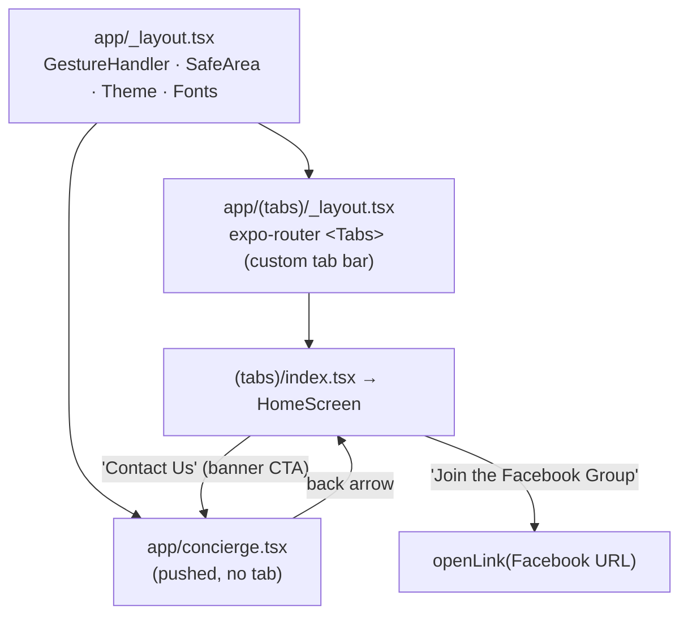
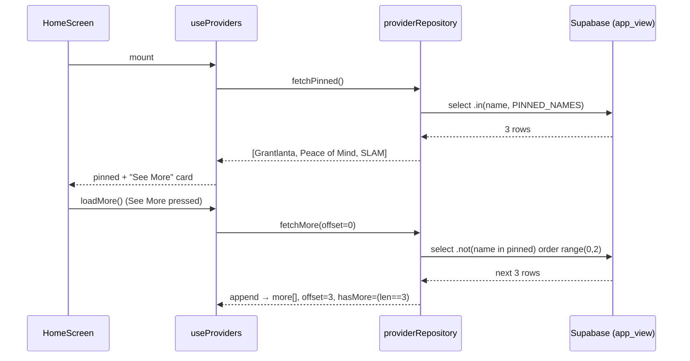

# Figma Refactor — Component & System Design

> Status: **design (pre-implementation)** · 2026-06-25 · Source of truth: Figma `RMu5KE0z5xbhi08LhY5eMW`
> Decisions locked in the `figma-refactor` memory. This doc turns the gap analysis into an implementable architecture.
> Next step after approval: `/sc:implement` in the sequence at the end.

---

## 1. Target file structure

```
app/
  _layout.tsx                 # MODIFY  root: providers + fonts (drop Roboto, add Open Sans)
  (tabs)/
    _layout.tsx               # NEW     expo-router Tabs shell (Home tab + custom tab bar)
    index.tsx                 # NEW     Home tab → <HomeScreen/>
  concierge.tsx               # NEW     pushed (non-tab) route → <ConciergeScreen/>

src/
  theme/
    tokens.ts                 # REWRITE from Figma variables
    typography.ts             # REWRITE from Figma variables
    ThemeProvider.tsx         # KEEP (shape unchanged; values flow from tokens)
    assets.ts                 # MODIFY daisy background source

  components/ui/
    Button.tsx                # REWRITE → Button (variants: full | small | large)
    Banner.tsx                # NEW     rust / mustard promo banner
    Card.tsx                  # KEEP/trim (or fold into BusinessCard)
    AppHeader.tsx             # NEW     cream bar, centered logo, optional back arrow
    Icon.tsx                  # NEW     thin wrapper over the icon set (arrow/phone/mail/…)

  features/
    home/
      HomeScreen.tsx          # NEW
      components/
        HelpBanner.tsx        # NEW  "Let us help you plan" → Contact Us
        CommunityBanner.tsx   # NEW  "Ask the community" → Facebook
    providers/
      CertifiedProviders.tsx  # NEW  section: header + horizontal row + See More
      BusinessCard.tsx        # NEW
      useProviders.ts         # NEW  pinned-3 + paginated "See More" state hook
      providerRepository.ts   # NEW  Supabase data access (directory_businesses_app_view)
      providerTypes.ts        # NEW  DirectoryBusiness type + mappers
    concierge/
      ConciergeScreen.tsx     # NEW  title + form (re-skinned)
    lead-form/                # KEEP logic; re-skin field UIs
      LeadForm.tsx            # MODIFY layout/skin only
      leadSchema.ts           # MODIFY budget → single value
      submitLead.ts           # MODIFY map single budget → DB array
      useLeadForm.ts          # KEEP
      fields/
        TextField.tsx         # REWRITE → label-inside input
        BudgetSelect.tsx      # NEW (replaces BudgetCheckboxGroup) dropdown
        DateField.tsx         # RESKIN
        FileField.tsx         # RESKIN → "Add a File" Button L

# REMOVE entirely:
#   src/features/landing/*            (Header, Hero, WavyDivider, WelcomeIntro,
#                                       InfoCardRow, LeadFormSection, Footer, LandingScreen, links)
#   src/features/background/*         (Skia overlay, shader, config, hook, tests)
#   src/features/lead-form/fields/BudgetCheckboxGroup.tsx
```

---

## 2. Navigation architecture



- **Tabs** render the bottom tab bar (Figma: cream `#FFF8EA`, `-0.5px` top hairline `#994706`, single **Home** item, Open Sans SemiBold 10, `#994706` active). Built with a **custom `tabBar`** to match the pixel design + home-indicator spacer.
- **Concierge** is a pushed screen (`router.push('/concierge')`), not a tab — reached from Home's "Contact Us" banner button. Its header shows the **back arrow**; Home's header hides it (`opacity 0`).
- Single-tab now, but the Tabs shell makes adding tabs later (Directory, etc.) trivial.

---

## 3. Theme tokens (rewrite spec)

`tokens.ts` — replace web-replica values with Figma variables:

```ts
export const colors = {
  // surfaces
  bg:         '#FFF8EA', // Vanilla — page base under daisy pattern
  surface:    '#FFFFFF', // cards / inputs
  // brand
  rust:       '#994706', // primary banner + primary button fill
  rustDark:   '#602A00', // Orange600 — borders + hard shadow
  mustard:    '#C18D22', // community banner + "See More"
  pumpkin:    '#DF7C3D',
  // text
  text:       '#1B1B1C', // Grey120 — primary text
  textSoft:   '#302B27', // Neutral700
  muted:      '#757371', // Neutral600 — placeholder / input label
  // input
  inputBorder:'#CCCAC9', // Neutral400
  black:      '#000000',
  white:      '#FFFFFF',
} as const;

export const radii = { input: 4, button: 8, card: 24, pill: 100 } as const;

// Signature hard-offset shadow (NOT a blur): offset (4,4), radius 0, color rustDark.
export const shadow = {
  hard: { shadowColor: colors.rustDark, shadowOffset: { width: 4, height: 4 },
          shadowOpacity: 1, shadowRadius: 0, elevation: 4 },
} as const;

export const fonts = {
  display:   'Shrikhand_400Regular',
  body:      'Bitter_400Regular',
  bodySemi:  'Bitter_600SemiBold',
  bodyBold:  'Bitter_800ExtraBold',
  tab:       'OpenSans_600SemiBold',   // tab label only
} as const;
```

`typography.ts` — variants mapped 1:1 to Figma named styles:

| Variant | Font | Size / line | Figma name |
|---|---|---|---|
| `displayL` | Shrikhand | 56 / 1.15 | Header L (Concierge title) |
| `displayS` | Shrikhand | 32 / 1.04 | Header S (banner titles) |
| `displayXS` | Shrikhand | 24 / 1.25 | Header XS (section headers) |
| `body` | Bitter Regular | 16 / 1.5 | Body Regular |
| `bodySemibold` | Bitter SemiBold | 16 / 1.5 | Body Semibold (Button Full) |
| `cardTitle` | Bitter ExtraBold | 12 / 1.5 | Caption Bold (card name) |
| `caption` | Bitter Regular | 12 / 1.5 | Caption Regular |
| `captionSemi` | Bitter SemiBold | 12 / 1.5 | Caption Semibold (Button S) |
| `seeMore` | Bitter SemiBold | 14 / 1.5 | Body XS Semibold |
| `tab` | Open Sans SemiBold | 10 | tab label |

> Font wiring (`app/_layout.tsx`): drop the three Roboto faces, add `Bitter_600SemiBold` + `Bitter_800ExtraBold` and `@expo-google-fonts/open-sans → OpenSans_600SemiBold`.

---

## 4. Component interface specs

```ts
// components/ui/Button.tsx — replaces the old pill Button
type ButtonVariant = 'full' | 'small' | 'large';
// full  → 56h, rust bg, border-3 rustDark, hard shadow, 8 radius, white Body Semibold (Concierge submit)
// small → 32h, cream/white bg, optional border, 8 radius, captionSemi  (banner CTAs, card phone)
// large → 56h, cream bg, no shadow  ("Add a File")
interface ButtonProps {
  label: string;
  onPress?: () => void;
  variant?: ButtonVariant;
  icon?: IconName;          // leading icon (arrowRight, phone, plus…)
  tone?: 'rust' | 'cream' | 'black'; // border/shadow color set
  disabled?: boolean;
  style?: StyleProp<ViewStyle>;
}

// components/ui/Banner.tsx
interface BannerProps {
  title: string;
  subtitle?: string;
  tone: 'rust' | 'mustard';     // rust = Help, mustard = Community
  cta: { label: string; icon?: IconName; onPress: () => void };
}

// components/ui/AppHeader.tsx
interface AppHeaderProps { showBack?: boolean; onBack?: () => void; } // logo always centered

// features/providers/BusinessCard.tsx
interface BusinessCardProps {
  business: DirectoryBusiness;  // see §5
  onCallPress: (phone: string) => void; // → openLink('tel:…')
}

// features/lead-form/fields/BudgetSelect.tsx — single-select dropdown
interface BudgetSelectProps { control: Control<LeadFormValues>; label: string; }
// renders input-container w/ dollar icon + chevron; opens a picker of BUDGET_OPTIONS
```

---

## 5. Data layer — Certified Providers

### 5.1 Type + view

Add to `lib/database.ts` (the app queries `directory_businesses_app_view`, never raw tables):

```ts
export interface DirectoryBusinessRow {
  id: string;
  source_uid: string;
  name: string;
  description: string | null;
  logo_url: string | null;
  longitude: number | null;
  latitude: number | null;
  recommended_score: number | null;
  has_coupon: boolean;
  has_google_marker: boolean;
  phone_numbers: { phone_number: string; normalized_phone_number: string }[] | null;
  created_at: string;
  updated_at: string;
}
```

`providerTypes.ts` exposes a view-model + mapper:

```ts
export interface DirectoryBusiness {
  id: string;
  name: string;
  tagline: string;          // description
  logoUrl: string | null;
  phone: string | null;     // phone_numbers[0].normalized_phone_number
  phoneDisplay: string | null; // formatted 678-790-4781
}
export function toBusiness(row: DirectoryBusinessRow): DirectoryBusiness;
```

### 5.2 Repository (pin-3 + See More pagination)

```ts
// providerRepository.ts  — Repository pattern; pure data access, returns Result<T>
const PINNED_NAMES = ['Grantlanta Lawn', 'Peace of Mind Recycling', 'SLAM Plumbing'] as const;
const PAGE_SIZE = 3;

interface ProviderRepository {
  // The 3 guaranteed cards, in canonical order. Query: .in('name', PINNED_NAMES)
  fetchPinned(): Promise<Result<DirectoryBusiness[]>>;

  // The next page of non-pinned providers for "See More".
  // Query: .not('name','in',`(${PINNED_NAMES})`)
  //        .order('recommended_score',{ascending:false}).order('name')
  //        .range(offset, offset + PAGE_SIZE - 1)
  fetchMore(offset: number): Promise<Result<DirectoryBusiness[]>>;
}
```

**Ordering decision:** pinned are fetched by name and re-sorted to `PINNED_NAMES` order. "See More" pages the remainder by `recommended_score DESC, name ASC` (stable, deterministic) in batches of 3. Offset starts at 0 for the first See-More press and increments by 3.

### 5.3 State hook + data flow

```ts
// useProviders.ts
type ProvidersState = {
  pinned: DirectoryBusiness[];   // always rendered first (the 3)
  more: DirectoryBusiness[];     // appended in pages of 3
  loading: boolean;              // initial pinned fetch
  loadingMore: boolean;          // See More in flight
  hasMore: boolean;              // last page returned PAGE_SIZE
  error: string | null;
  loadMore: () => void;          // press handler for "See More"
};
```



> Failure handling: pinned fetch error → section shows a quiet retry (never crashes Home). See More error → inline message on the card, button re-enabled. (Per global error-handling rule: explicit, user-friendly, no silent swallow.)

---

## 6. ConciergeForm / lead form changes

**Layout (Figma 2.ConciergeForm):** `AppHeader(showBack)` → `displayL` title "Let's Plan Something Awesome" → vertical fields (16 gap) → "Add a File" (Button large) → submit (Button full). No two-column row (Figma stacks First/Last name full-width).

**Field re-skin → "label-inside" input** (white, `#CCCAC9` border, 4 radius, 58h, leading icon):

| Field | Icon | Control |
|---|---|---|
| First Name / Last Name | — | TextField |
| Email | envelope | TextField (email) |
| Phone | phone | TextField (phone-pad) |
| Address | house | TextField |
| **Budget** | dollar + chevron | **BudgetSelect (single dropdown)** |
| Project Start Date | calendar | DateField |
| Project Details | — (label-top, 131h) | TextField multiline |
| Add a File | plus circle | FileField as Button large |

**Budget single-select (no DB migration):**
- `leadSchema.budget`: `z.enum([...]).optional()` (was `z.array`).
- `emptyLeadForm.budget`: `undefined`.
- `submitLead`: map `budget ? [budget] : []` → keeps DB column `budget BudgetValue[]` valid. (Cleaner long-term: migrate column to scalar enum; deferred — array-of-one is forward-compatible.)
- `BUDGET_OPTIONS` unchanged (reused as dropdown items).

**Form states** (already modeled by `useLeadForm`: idle/submitting/success/error) map to the 4 Figma frames (`13:7034/7229/7421` = default/filled/validation/success — confirm exact mapping when skinning). Submit label: Figma shows placeholder "Button Text" → use **"Submit"** (confirm copy).

---

## 7. Implementation sequence (for `/sc:implement`)

1. **Theme** — rewrite `tokens.ts` + `typography.ts`; swap fonts in `_layout.tsx`; update `assets.ts` daisy bg. *(Nothing renders yet but unblocks everything.)*
2. **Primitives** — `Button` (3 variants), `Banner`, `AppHeader`, `Icon`. Unit-render tests.
3. **Nav shell** — `app/(tabs)/_layout.tsx` (custom tab bar) + `(tabs)/index.tsx` + `app/concierge.tsx`; delete `app/index.tsx` + `features/landing/*` + `features/background/*`.
4. **Providers data** — `database.ts` type, `providerTypes`, `providerRepository`, `useProviders` (+ repo tests with a mocked Supabase).
5. **Home** — `HomeScreen` = HelpBanner + CertifiedProviders(+BusinessCard, See More) + CommunityBanner.
6. **Concierge** — re-skin fields, `BudgetSelect`, schema/submit budget change, `ConciergeScreen`; wire Home "Contact Us" → push.
7. **Verify** — `tsc`, `jest`, `expo export`, `expo-doctor`; then device check (`bun start -c`) — Skia/native correctness can't be confirmed headless.

---

## 8. Risks / open confirmations
- **Budget DB shape** — recommend array-of-one (no migration). Flag if a scalar column is preferred.
- **Submit button copy** — Figma placeholder "Button Text" → assuming "Submit".
- **See More order** — `recommended_score DESC, name ASC` assumed; confirm if a curated order is wanted.
- **Concierge state frames** — exact field-error styling to be lifted from `13:7229/7421` during skinning.
- **Tab bar** — single Home tab now; custom `tabBar` component (not default) to hit the pixel spec.
