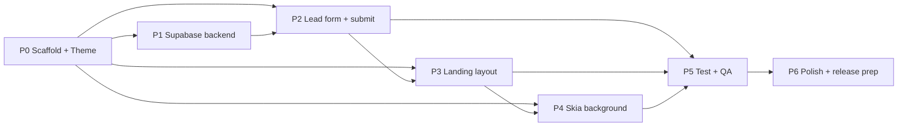

# The Southern Shmooze — Implementation Workflow

> Phased build plan produced via `/sc:workflow`. **Plan only — no code executed.**
> Derives from [`../architecture/README.md`](../architecture/README.md) and
> [`../mvp-requirements/README.md`](../mvp-requirements/README.md). Execute with `/sc:implement`.

**Strategy:** systematic, form-first · **Targets:** iOS + Android · **Tooling:** Bun + Expo
**Generated:** 2026-06-24

---

## Guiding sequencing principle

Ship the **functional centerpiece (lead form → Supabase) first**, then the visual 1:1
landing, then the **highest-risk/highest-effort animated background last** (isolated, so it
can iterate without blocking a working app). TDD per repo standards: tests precede or
accompany each unit; 80%+ coverage gate.

Parallelizable: **P1** (backend) and the static parts of **P3** (landing layout) can run
alongside **P2** once **P0** lands. **P4** is independent of P1/P2.

---

## Phase 0 — Project scaffold & design system  *(foundation; blocks all)*

| ID | Task | Acceptance check |
|---|---|---|
| 0.1 | `bunx create-expo-app` (TS, Expo Router), commit baseline | app boots on iOS + Android sim via `bun expo start` |
| 0.2 | Add deps (skia, RHF, zod, supabase-js, pickers, datetimepicker, web-browser, google-fonts, url-polyfill) | `bun install` clean; app still boots |
| 0.3 | `app.config.ts` with `extra.SUPABASE_URL/ANON_KEY` from env; `.env` + example | missing env throws clear startup error |
| 0.4 | `src/theme/tokens.ts` + `typography.ts` from designlang tokens | tokens exported, typed |
| 0.5 | Font loading in `app/_layout.tsx` (Shrikhand/Bitter/Roboto), render-gated | fonts render on device |
| 0.6 | `components/ui` primitives (Button pill, Card) + `lib/result.ts` | Button/Card match tokens in a sandbox screen |

**Checkpoint C0:** blank themed app boots on both platforms with fonts + tokens wired.

---

## Phase 1 — Supabase backend  *(can run parallel to P3 static work)*

| ID | Task | Acceptance check |
|---|---|---|
| 1.1 | Create Supabase project; capture URL + anon key into env | client connects |
| 1.2 | `leads` table migration (schema per architecture §8.1) | table exists with correct types/defaults |
| 1.3 | Private `lead-uploads` storage bucket + size limit | bucket exists, not public |
| 1.4 | RLS: anon **INSERT-only** on `leads` and bucket; deny SELECT/UPDATE/DELETE | anon insert succeeds; anon select rejected (verified) |
| 1.5 | `src/lib/supabase.ts` singleton (+ url-polyfill), startup env validation | manual insert from app writes a row |

**Checkpoint C1:** a scripted/manual insert + file upload with the anon key succeeds; anon
read is denied. **Security gate:** confirm no service-role key in the app bundle.

---

## Phase 2 — Lead form + submission  *(MVP centerpiece)*

| ID | Task | Acceptance check |
|---|---|---|
| 2.1 | `leadSchema.ts` (zod) for all 11 fields + honeypot + budget enum mapping | unit tests: valid/invalid/honeypot pass |
| 2.2 | Field components: TextField, PhoneField, BudgetCheckboxGroup (multi), DateField, FileField (any type), TextAreaField | each renders + reports value/errors |
| 2.3 | `LeadForm.tsx` + `useLeadForm.ts` (RHF + resolver), inline errors | required fields block submit with messages |
| 2.4 | `submitLead.ts`: client UUID → upload file → insert row → `Result<T>` | integration tests vs mocked client (happy + upload-fail + insert-fail) |
| 2.5 | UI states idle→submitting→success/error; disable on submit; reset on success | manual: real submission writes row + file; success shown |
| 2.6 | A11y: labels, honeypot hidden, keyboard types | a11y checks pass |

**Checkpoint C2:** end-to-end real submission (with and without a file) lands in Supabase
`leads` + Storage; failure path shows a retryable error and preserves input.

---

## Phase 3 — Landing layout (1:1 visual)  *(needs P2 for the form section)*

| ID | Task | Acceptance check |
|---|---|---|
| 3.1 | `Header` (logo, Membership/Directory/Resources, socials, Browse Directory) → open live site via web-browser | taps open correct URLs |
| 3.2 | `Hero` (circular logo badge + headline, Shrikhand scale) | matches hero screenshot |
| 3.3 | `WavyDivider` replicating section divider | visually matches |
| 3.4 | `WelcomeIntro` + service line; `InfoCardRow` (Ask/Browse/Let Us Help) | matches screenshots |
| 3.5 | `LeadFormSection` embeds `LeadForm`; `Footer` © line | composes in scroll |
| 3.6 | `LandingScreen` assembly in transparent ScrollView (bg slot reserved) | full page scrolls, matches `full-page.png` on a phone |

**Checkpoint C3:** landing visually matches the live site on a phone (compare against
`design-extract-output/screenshots/responsive/mobile-*`), form works inside it.

---

## Phase 4 — Animated background (Skia)  *(highest risk; isolated, last)*

| ID | Task | Acceptance check |
|---|---|---|
| 4.1 | `AnimatedBackground` Skia Canvas: daisy `background.png` as cover Image | static daisy layer renders behind content |
| 4.2 | `isometricShader.ts` SkSL: noise → iso height-field → light → cream→orange, `a=0.2` | overlay renders, tints correctly |
| 4.3 | Map captured uniforms (speed 12, noiseScale 77, scale 76/39/95, light, range 69) | values wired; unit test on uniform mapping |
| 4.4 | `useBackgroundMotion`: `useClock` time uniform; morph animates | overlay visibly morphs at 60fps |
| 4.5 | Reduce-motion + AppState gating (freeze clock) — no pause button | reduce-motion freezes; backgrounding pauses |
| 4.6 | Perf pass (downsample image, frame profiling) | sustained ~60fps on mid device |

**Checkpoint C4:** background reads as the site's moving daisy field; halts under
reduce-motion. **Decision gate:** if shader 1:1 runs long, invoke documented captured-loop
fallback (architecture §6) — flag to user before switching.

---

## Phase 5 — Testing & QA

| ID | Task | Acceptance check |
|---|---|---|
| 5.1 | Unit: schema, budget mapping, Result, shader uniforms | green |
| 5.2 | Integration: `submitLead` (happy/upload-fail/insert-fail) | green |
| 5.3 | Component: `LeadForm` renders 11 fields, blocks invalid, shows success | green |
| 5.4 | E2E (Maestro/Detox): fill→submit→success; reduce-motion freezes bg | green on iOS + Android |
| 5.5 | Coverage report | ≥80% |

**Checkpoint C5:** full suite green on both platforms, coverage gate met.

---

## Phase 6 — Polish & release prep

| ID | Task | Acceptance check |
|---|---|---|
| 6.1 | App identity: name, icon, splash from site branding | configured in `app.config.ts` |
| 6.2 | Resolve open items: upload size cap (≈25 MB), nav placeholder behavior | confirmed with user |
| 6.3 | Device matrix visual QA vs responsive screenshots | parity acceptable |
| 6.4 | Final security review (no secrets, insert-only RLS, input validation) | security-reviewer pass |
| 6.5 | EAS build config (dev/preview) | builds produced |

**Checkpoint C6:** installable build matching the site, secure, tests green.

---

## Cross-cutting quality gates (every phase)
- TDD: tests precede/accompany units; no phase closes red.
- Immutability, small files (<800 lines), `Result<T>` at boundaries, no hardcoded secrets.
- Lint/format/typecheck clean before each checkpoint.

## Risk register
| Risk | Impact | Mitigation |
|---|---|---|
| Skia 1:1 of proprietary isometric art | High effort | Isolated P4; captured-loop fallback; 0.2 opacity lowers perceptual delta |
| Anon-key insert abuse/spam | Med | Insert-only RLS, honeypot, size caps, future rate limit |
| Real notification flow unknown | Low (out of scope) | Store-only now; revisit with owners |
| File "any type" → large/unsafe uploads | Med | Client size cap + bucket limit; private bucket |
| Font/layout fidelity across devices | Med | Compare against responsive screenshots in C3/C6 |

## Rough effort shape (relative)
P0 S · P1 S · **P2 M (centerpiece)** · P3 M · **P4 L (riskiest)** · P5 M · P6 S.
Critical path: P0 → P2 → P3 → P5 → P6, with P4 joining before P5.

## Next Step
`/sc:implement` starting at **Phase 0**, honoring each checkpoint as a stop/review gate.
