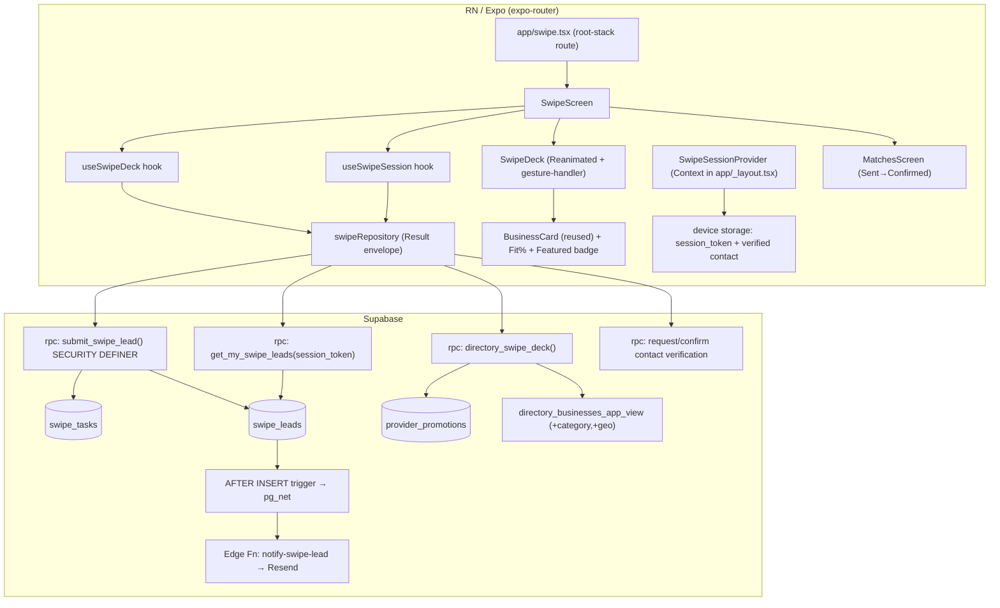
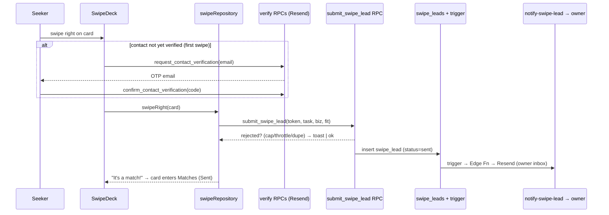

# The Shmoozer — Swipe Lead-Funnel

> Tinder-style swipe surface for The Southern Shmooze (RN / Expo), pivoting the app
> toward "TaskRabbit for local business." A Seeker states a need, swipes through
> relevant providers, and a right-swipe broadcasts an intent-rich lead.
>
> **Status:** Requirements locked · Design complete · Implementation not started.
> Source brainstorm: Serena memory `the-shmoozer-swipe-brainstorm`.

---

## 1. Requirements (locked)

| Decision | Value |
|---|---|
| Model | **One-sided lead funnel** — only the Seeker swipes; businesses don't swipe back in v1 |
| Intake | **Task-first** — need captured once per session (category + location/radius + budget + timing) |
| Right-swipe | **Instant lead**, broadcast (no cap) via the existing Concierge → Resend pipeline |
| Left-swipe | Pass |
| Primary goal | **Lead-generation funnel** (monetize via lead value + featured placement) |
| "Match" | 2-stage: **Stage 1** "It's a match!" on right-swipe (lead sent) → **Stage 2** "Confirmed" when business responds |
| Fit Score | **Exact %** ("87% match"), deterministic & explainable |
| Account | **Not required** — capture Seeker contact once on first right-swipe |
| Featured placement | **v1 requirement** — labeled slot, shows the provider's *true* Fit % |
| Surface name | **"The Shmoozer"** |

**Anti-abuse defaults (accepted):** lightweight contact verification (confirm email before first send) + per-Seeker daily send caps + per-business lead throttling.

**Out of scope (v1):** business-side swiping / accept-decline (phase 2), in-app chat, payments, scheduling, bookings, in-app reviews.

---

## 2. Two hard prerequisites (P0 — block everything)

1. **No category taxonomy exists in app data.** `DirectoryBusiness` and `directory_businesses_app_view` carry `name, description, is_certified, has_coupon, recommended_score, phones, lat/lng` — **no category/tags**. Task-first filtering *and* the Fit Score's category component require a category taxonomy surfaced from the MembershipWorks source.
2. **Lat/lng dropped from the view-model.** `toBusiness()` discards `latitude/longitude`; the distance component needs them carried into the deck payload.

---

## 3. System architecture



### Decisions vs. existing codebase

| Concern | Existing pattern | Shmoozer decision | Why |
|---|---|---|---|
| Route | `app/business/[uid].tsx` root-stack subpage | `app/swipe.tsx` → `src/features/swipe/SwipeScreen.tsx` | Same pattern, off the Directory |
| Data fetch | repo → `.rpc()` returning `Result<T>` | New `swipeRepository` → RPCs, same `Result` envelope | Consistent |
| Lead write | direct `supabase.from("leads").insert()` | **`submit_swipe_lead` SECURITY DEFINER RPC** | Anon can't self-enforce caps/throttle/verification — must be server-atomic |
| Deck scoring/order | client `.order()` | **server RPC computes Fit Score + featured slots** | Score must be trustworthy; featured placement is monetization (not client-trustable) |
| Session state | bespoke hook + `useState` | New `SwipeSessionProvider` Context in `app/_layout.tsx` | Task + verified contact must survive swipe-page ↔ tabs nav |
| State library | none | **none** (Context + hooks; no zustand) | Stay consistent |

---

## 4. Data model — migration `0016_shmoozer.sql`

```sql
-- 4.1 Featured placement (time-bound, paid tiers)
create table public.provider_promotions (
  id            uuid primary key default gen_random_uuid(),
  business_uid  text not null,            -- → directory_businesses.source_uid
  tier          text not null default 'featured',
  starts_at     timestamptz not null default now(),
  ends_at       timestamptz,
  active        boolean not null default true,
  created_at    timestamptz not null default now()
);
create index on public.provider_promotions (business_uid) where active;

-- 4.2 One task per seeker session (captured once)
create table public.swipe_tasks (
  id            uuid primary key default gen_random_uuid(),
  session_token uuid not null,            -- anonymous device identity
  category      text not null,            -- requires category taxonomy (P0)
  origin_lat    double precision,
  origin_lng    double precision,
  radius_km     integer not null default 25,
  budget        text,                     -- reuse leadSchema enum: lt_1000|1000_5000|gt_5000
  timing        text,                     -- asap|this_week|flexible
  contact_name  text,
  contact_email text,
  contact_phone text,
  contact_verified boolean not null default false,
  created_at    timestamptz not null default now()
);
create index on public.swipe_tasks (session_token);

-- 4.3 One row per right-swipe (broadcast = N rows sharing task_id)
create table public.swipe_leads (
  id            uuid primary key default gen_random_uuid(),
  task_id       uuid not null references public.swipe_tasks(id),
  session_token uuid not null,
  business_uid  text not null,            -- targeted provider
  fit_score     integer not null,         -- exact % snapshot at swipe time
  status        text not null default 'sent',  -- sent → confirmed → closed
  created_at    timestamptz not null default now(),
  unique (task_id, business_uid)          -- dedup: no double-send per task
);
create index on public.swipe_leads (session_token);
create index on public.swipe_leads (business_uid, created_at);  -- throttle window
```

**RLS posture** (mirrors `leads`: anon write-constrained, never reads tables directly): no direct anon access to any of the three tables. All reads/writes flow through `SECURITY DEFINER` RPCs that validate `session_token` — the safe extension of the existing "anon INSERT-only" `leads` policy to support anonymous read-back.

---

## 5. Fit Score — deterministic & explainable

Computed **server-side** in `directory_swipe_deck`, returned with sub-scores so the UI shows an exact number *and* a "why" breakdown. Weighted sum 0–100, rounded:

| Component | Weight | Rule |
|---|---|---|
| Category match | 35 | exact = 35; adjacent/parent = 18; else excluded from deck |
| Distance | 30 | `30 * (1 − dist_km / radius_km)`, clamped ≥ 0 (haversine from task origin) |
| Budget fit | 15 | band overlaps = 15; partial = 7; unknown = 7 (neutral) |
| Availability | 10 | **contingent on data** — if absent, folds into neutral baseline (R-2) |
| Certified | 10 | `is_certified` = 10; else 0 |

`fit_score = round(Σ components)` — no randomness, so "87%" is reproducible. Certified-first ordering preserved as the **secondary sort** after score (consistent with existing `.order("is_certified", desc)`).

**Featured placement (T-1):** featured providers are injected into **labeled slots** (e.g. 1 per 5 cards), carry an `is_featured` flag → UI "Featured" badge, and **still display their real `fit_score`**. Position boosted; number never faked.

---

## 6. RPC API specifications

```text
directory_swipe_deck(
  p_category text, p_lat float8, p_lng float8, p_radius_km int,
  p_budget text, p_session_token uuid, p_exclude uuid[], p_limit int
) RETURNS setof deck_card
-- deck_card: { business_uid, name, logo_url, is_certified, has_coupon,
--   distance_km, fit_score, fit_breakdown jsonb, is_featured bool }
-- Filters: category match + within radius + NOT business-throttled.
-- Orders: featured-slot injection over (fit_score desc, is_certified desc, name).

submit_swipe_lead(  -- SECURITY DEFINER; enforces ALL abuse rules atomically
  p_session_token uuid, p_task_id uuid, p_business_uid text, p_fit_score int
) RETURNS result
-- Rejects if: contact not verified | seeker over daily cap |
--   business over throttle | duplicate (task_id,business_uid).
-- Else inserts swipe_lead (status='sent').

get_my_swipe_leads(p_session_token uuid) RETURNS setof my_lead
-- my_lead: { business_uid, name, logo_url, status, created_at }
-- The ONLY read path for the anonymous seeker's Matches screen.

request_contact_verification(p_session_token uuid, p_email text) RETURNS result
confirm_contact_verification(p_session_token uuid, p_code text) RETURNS result
-- Email OTP via Resend (reuses existing email infra). Sets contact_verified=true.
```

---

## 7. Lead delivery

`swipe_leads` AFTER INSERT trigger → `pg_net` → **new `notify-swipe-lead` Edge Function** (clone of `notify-lead`: same `X-Sync-Secret` auth, Resend client, shared `_shared/lead-email.ts`).

**Recipient (R-1):** the directory has provider phone/website/socials but **no confirmed business email**. So v1 routes swipe leads to the **Shmooze team/owner inbox** (matching today's `hi@appdaddystudios.com` behavior) as the monetizable lead inbox — owner forwards/sells. Direct-to-business email is phase 2, gated on capturing provider emails.

---

## 8. Client interfaces (definitions only)

```ts
// src/features/swipe/swipeTypes.ts
export interface SwipeTask {
  category: string; originLat?: number; originLng?: number;
  radiusKm: number; budget?: BudgetBand; timing?: Timing;
}
export interface SeekerContact { name: string; email: string; phone?: string; verified: boolean; }
export interface DeckCard extends DirectoryBusiness {   // extends existing view-model
  distanceKm: number; fitScore: number; fitBreakdown: FitBreakdown; isFeatured: boolean;
}
export interface SwipeMatch {
  businessUid: string; name: string; logoUrl: string | null;
  status: "sent" | "confirmed" | "closed"; createdAt: string;
}
export interface SwipeSession {
  task: SwipeTask | null; contact: SeekerContact | null; sessionToken: string;
  setTask(t: SwipeTask): void; captureContact(c: SeekerContact): void;
}
// Hooks (mirror useDirectorySearch; repo injectable for tests)
// useSwipeDeck(repo) → { cards, loading, swipeRight(card), swipeLeft(card), undo() }
// useMatches(repo)   → { matches, refresh() }
```

- **Deck UI:** compose `Gesture` / `useSharedValue` / `useAnimatedStyle` (already present: reanimated 4.3.1, gesture-handler 2.31.1) over the existing `BusinessCard`. No `react-native-deck-swiper` dependency needed.
- **Reused components:** `BusinessCard`, `CertifiedBadge`, `CardBadge`, `SearchEmptyState` (→ "no more cards"), `Button`, `PhysicalPressable`.
- **`session_token`:** generated with `expo-crypto` (already used in `submitLead.ts`), persisted on-device so Matches survive restart.

---

## 9. Sequence — right-swipe (verify + broadcast)



---

## 10. Anti-abuse enforcement (all server-side)

- **Contact verification** = email OTP via Resend, gating the *first* `submit_swipe_lead`. (Phone OTP deferred — needs a new SMS provider.)
- **Per-Seeker daily cap** = count `swipe_leads` for `session_token` (+ `contact_email`) in trailing 24h; reject over limit.
- **Per-business throttle** = `directory_swipe_deck` hides over-subscribed providers; `submit_swipe_lead` also rejects, so throttled businesses can't be hit via stale decks.

---

## 11. New dependencies

1. **`expo-location`** (+ permission) for distance, with a manual zip/city geocode fallback.
2. **On-device persistence** for `session_token` + verified contact (`@react-native-async-storage/async-storage` or `expo-secure-store`).
3. **`notify-swipe-lead` Edge Function** + migration `0016`.

---

## 12. Risks / open decisions

| ID | Risk | v1 resolution |
|---|---|---|
| R-1 | No business emails | Route leads to owner inbox (owner-as-broker); direct-to-business = phase 2 |
| R-2 | Availability data may not exist | Drop the 10-pt component, re-normalize to 100 |
| R-3 | **Category taxonomy (P0)** | Surface from MembershipWorks source *before* Phase 1 |
| R-4 | Who flips `sent`→`confirmed`? | v1 = owner/admin action; phase 2 = business self-serve |

---

## 13. Implementation Workflow

### Phase 0 — Data prerequisites *(blocks everything)*
- **0.1** Source a category taxonomy from MembershipWorks (folders/account-types) → add `category` (and/or `tags`) to `directory_businesses`; backfill via the existing sync.
- **0.2** Carry `latitude`/`longitude` (and `category`) through `directory_businesses_app_view` and into `toBusiness()` / `DirectoryBusiness`.
- **Acceptance:** deck candidates can be filtered by category and have usable coordinates.

### Phase 1 — Core funnel
| # | Task | Depends on | Acceptance |
|---|---|---|---|
| 1.1 | Migration `0016`: `provider_promotions`, `swipe_tasks`, `swipe_leads` + RLS | 0.1 | Tables apply; anon has no direct table access |
| 1.2 | RPC `directory_swipe_deck` (filter + Fit Score + featured slots) | 1.1, 0.2 | Returns ranked deck with exact `fit_score` + breakdown |
| 1.3 | RPCs `request_/confirm_contact_verification` + `notify` email | 1.1 | Email OTP verifies a contact; `contact_verified` flips |
| 1.4 | RPC `submit_swipe_lead` (SECURITY DEFINER; caps/throttle/dedup) | 1.1, 1.3 | Rejects unverified/over-cap/throttled/dupe; else inserts |
| 1.5 | RPC `get_my_swipe_leads` | 1.1 | Anonymous seeker reads own leads by `session_token` |
| 1.6 | `notify-swipe-lead` Edge Fn + AFTER INSERT trigger | 1.4 | Right-swipe emails owner inbox via Resend |
| 1.7 | `SwipeSessionProvider` + on-device persistence | — | Task + verified contact survive nav & restart |
| 1.8 | `swipeRepository` + `useSwipeDeck` / `useMatches` hooks | 1.2,1.4,1.5 | `Result`-enveloped, repo injectable for tests |
| 1.9 | `TaskIntake` screen (category/location/radius/budget/timing) | 1.7 | Captures task; gates the deck |
| 1.10 | `SwipeDeck` (Reanimated gestures over `BusinessCard`) + Fit% + Featured badge | 1.8 | 60fps swipe; left=pass, right=lead; undo last |
| 1.11 | `ContactCapture` + verify modal (first right-swipe) | 1.3,1.7 | Blocks first send until verified |
| 1.12 | `MatchesScreen` (Sent→Confirmed) | 1.5 | Lists leads + status; polls |
| 1.13 | `app/swipe.tsx` route + Directory CTA entry point | 1.9 | "The Shmoozer" reachable from Directory |
| 1.14 | Tests (hooks w/ injected repo; Fit Score; RPC guards) | all | ≥80% on new feature code |

### Phase 2 — Later
Business-facing accept/decline (true mutual match), direct-to-business email, phone OTP, paid-tier promotion-management UI.

---

## 14. Next step

Resolve **Phase 0** (R-3 category taxonomy) before `/sc:implement`. Then implement Phase 1 in the order above.
